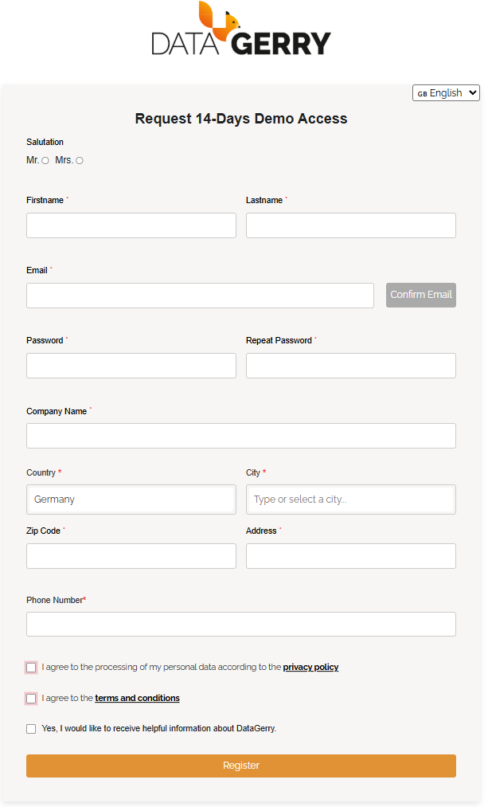
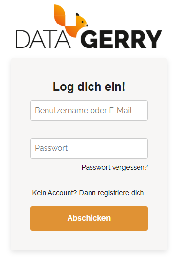
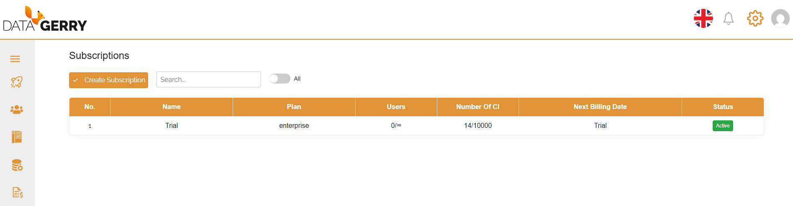
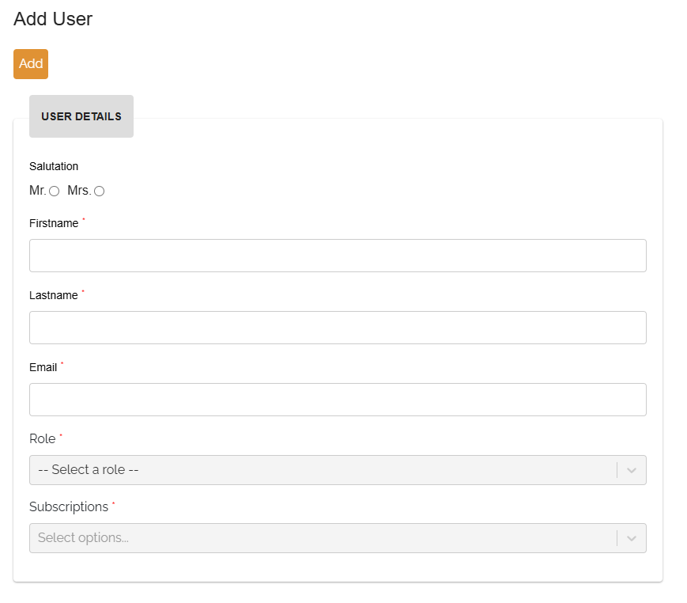
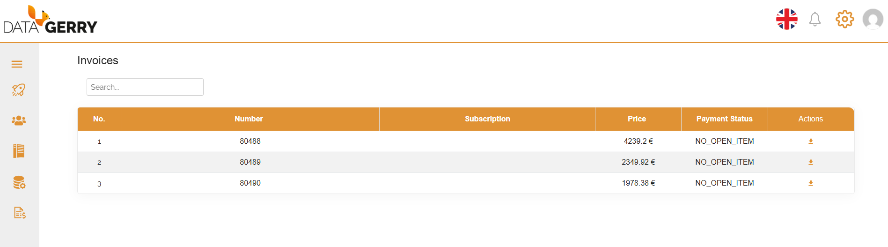

*************
Cloud version
*************

.. contents:: Table of Contents
    :local:

| 

=======================================================================================================================

| 

Sign up
=======

To get started with the **Cloud version** of DataGerry, follow these steps:

1. Visit the sign-up page: `Sign up to DataGerry <https://service.datagerry.com/demo>`_
2. Fill out the registration form with your details.
3. Press the "Confirm Email" button to recieve a confirmation link
4. Check your email inbox and confirm your email address using the verification link.
5. Once confirmed, you'll receive access to a **free 14-day trial** of DataGerry in the cloud.

    Picure: Sign up form

| 

After signing up, you'll be redirected to the login page of the Service Portal, where you can start
exploring the platform immediately.

.. note::
   The trial version includes all core features of DataGerry and allows you to evaluate the software without any
   installation effort.

| 

=======================================================================================================================

| 

Login
=====

To access your DataGerry Cloud instance, follow these steps:

1. Open the login page: `Login to Service Portal <https://service.datagerry.com/login>`_
2. Enter your **email address** and the **assigned password** used during registration.
3. Click **Login** to access your Service Portal.

    Picure: Login page for Service Portal

| 

.. note::
   Make sure to use the same email address you verified during the sign-up process.

| 

=======================================================================================================================

| 

=======================================================================================================================

| 

Service Portal
==============

The **Service Portal** provides an interface for managing cloud-based DATAGERRY subscriptions and configurations.

| 

Subscription Management
-----------------------

After logging into the Service Portal, the **Subscription** section is loaded by default. This section lists all current
subscriptions linked to your user account.

Each subscription represents an isolated environment with its **own database**. This ensures that data is not shared
or mixed across subscriptions.

    Picure: Subscriptions overview

| 

.. note::
   If your account is linked to multiple subscriptions, a **dropdown selector** will appear on the DataGerry login page.
   This allows you to choose the subscription you wish to access.

| 

Creating a New Subscription
~~~~~~~~~~~~~~~~~~~~~~~~~~~

To create a new subscription:

1. Click the **"Add Subscription"** button above the subscription table.
2. Fill in the required details in the form.
3. Submit to initialize a new isolated instance of DataGerry in the cloud.

Each subscription is managed independently, allowing you to test, separate business units, or operate multi-environment
setups with ease.

| 

=======================================================================================================================

| 

User Management
---------------

The **Users** section, accessible via the left sidebar in the Service Portal, provides an overview of all users
associated with your account. Existing users are displayed in a table, including their email address and assigned roles.

| 

Creating a New User
~~~~~~~~~~~~~~~~~~~

To add a new user:

1. Click the **"Add User"** button located above the user table.
2. Fill in the required fields in the user creation form.

    Picure: User creation form

| 

The form includes the following options:

- **Role**:
  
  - ``Admin``: Grants full access to both the Service Portal and the connected DataGerry instance.
  - ``Cloud User``: Grants access to the DataGerry instance only, without permissions to use the Service Portal.

- **Subscriptions**:

  - Assign the user to one or more active subscriptions.
  - The user will only be able to log into the DataGerry environments tied to the selected subscriptions.

.. note::
   A user assigned the **admin** role has management privileges and can modify subscription settings, user access,
   and billing configurations.

| 

=======================================================================================================================

| 

Documentation & Cloud Access
----------------------------

In the left sidebar of the Service Portal, two quick access links are provided for convenience:

- **Documentation**:  
  Redirects to the official DataGerry documentation. This link helps users quickly access user guides, feature
  descriptions, and technical references.

- **Cloud Access**:  
  Opens the login page of the DataGerry Cloud instance. This allows users to easily switch from managing their
  subscription in the Service Portal to working within their assigned DataGerry environment.

| 

=======================================================================================================================

| 

Invoices
--------

The **Invoices** section, accessible from the left sidebar of the Service Portal, provides an overview of all
billing documents.

- A table lists all invoices associated with the active account.
- Invoices can be downloaded individually as PDF files for record-keeping or internal processing.

    Picure: Invoices overview

| 

=======================================================================================================================

| 

Settings and Account Management
-------------------------------

In the **top right corner** of the Service Portal interface, a settings section is available with several options:

- **Language Selection**: Change the interface language.
- **Account Information**: View and edit personal account details such as name, email, and password.
- **API Tokens**: Manage API tokens, which are required to authenticate external access to the DataGerry API.
- **Logout**: Safely log out of the Service Portal.

These settings help personalize the experience and enable secure integration with external systems.