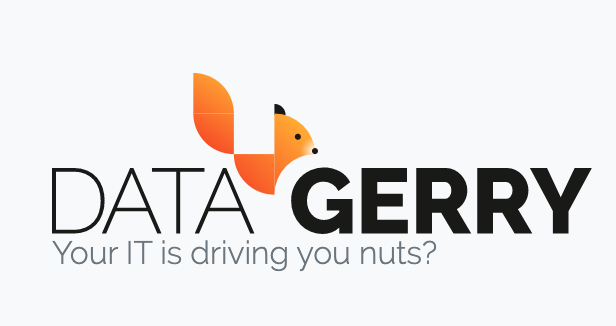

************
Introduction
************

| 

**DataGerry** is an enterprise-grade, open-source **Configuration Management Database (CMDB)** and **Asset Management Tool**
that gives you full flexibility to define, customize, and manage your data models. Unlike conventional tools with rigid
schemas, DataGerry allows you to model any type of object—servers, routers, locations, licenses, or entirely
custom assets—based on the unique requirements of your organization.

| 

**Key Features**

- **Customizable Data Models**  
    Design object types with custom fields and relationships. You're not limited by predefined structures—every data model is
    entirely user-defined.

- **User-Friendly Interface**  
    A clean and intuitive web interface helps you efficiently manage assets and configuration items with minimal learning curve.

- **Integration & Automation Capabilities**  
    Integrate with external tools via a powerful REST API or automate workflows in real time using webhooks.

- **Reporting and Import/Export Tools**  
    Import and export data in formats like CSV, JSON, XML, and XLSX. Build custom reports and queries using the integrated
    report builder.

- **Scalable and Extensible**  
    Designed for growth, DataGerry supports multi-tenancy in the cloud version and handles large, complex environments

| 

**Why DataGerry?**

With its flexible data modeling, seamless integration options, and extensibility, DataGerry supports smarter
decisions, streamlined automation, and full visibility across your entire IT landscape.

.. | 

.. =======================================================================================================================

.. | 

.. If you need assistance, please refer to the following resources for support and information:

.. - `DATAGERRY Website <https://datagerry.com>`_
  
..   Visit the official DATAGERRY website for comprehensive information about the tool and its features.

.. - `Professional Services <https://datagerry.com/professional-services/>`_
  
..   Explore our professional services for expert guidance, custom solutions, and support tailored to your specific needs.

.. - `Community Support <https://community.datagerry.com>`_
  
..   Join the DATAGERRY community forum to connect with other users, share experiences, ask questions, and find
..   solutions collaboratively.

.. - `Source Code <https://github.com/DATAGerry/DATAGerry/>`_
  
..   Access the DATAGERRY source code on GitHub to review the codebase and gain a deeper understanding of the tool.
