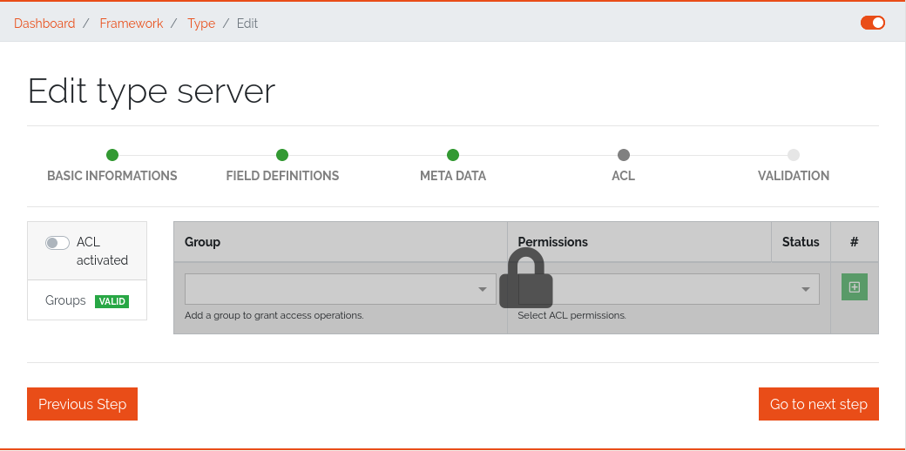

*************************
Access Control List (ACL)
*************************

Datagerry uses multiple access controls to restrict the access to data and functions.
In addition to the :ref:`system-access-rights`. implemented by default at the user management level,
there is also the concept of the access control list. These are currently only implemented for the object level,
but will be extended to various sections of the core framework.
They should provide more precise setting options for accesses within already authorized levels/functions.

| 

=======================================================================================================================

| 

Access Control List
-------------------
The concept of ACL is basically very simple. They are, as the name suggests,
lists that have group references with certain permissions. In our case, the user group is stored there.
So if a user wants to get access via an ACL, this is only possible if the complete user group is listed in the ACL.
The permissions define which actions are granted to a group within an ACL.
This allows different operations to be defined even more precisely.

| 

Permissions
^^^^^^^^^^^
By default, four permissions are possible:

- **Create** a resource
- **Read** a resource
- **Update** a resource
- **Delete** a resource

based on the four basic functions of persistent storage.
Further permissions can theoretically be added, but these are not planned at the moment.

| 

ACL vs. System-Rights
^^^^^^^^^^^^^^^^^^^^^
The difference between the system rights and the ACL is that the ACL only improves the system rights
and makes the accesses more detailed. They are **not a replacement** for the rights, they only extend the restrictions.
Groups that do not have rights for certain actions (for example: viewing an object) cannot do this,
even if their group is explicitly listed in the respective ACL.

| 

=======================================================================================================================

| 

Object ACL
----------
The ACLs of the objects protect them from unauthorized access.
They are used to make objects accessible to certain user groups or to hide them.
This affects not only the view of the objects themselves, but any aspect of CRUD access to objects,
up to and including search, export, etc.

In principle, there are five different access situations to objects.

.. csv-table:: Table 3: Access situations
   :header: "Configuration", "Access"
   :width: 100%
   :widths: 50 50
   :align: left

   "No ACL defined", "Everyone has access to objects of this type"
   "ACL deactivated", "Everyone has access to objects of this type"
   "ACL enabled, but group not included", "No access to objects of this type"
   "ACL enabled and group included, but not the grant permission of the operation", "No access to objects of this type"
   "ACL enabled and group included and grant permission of the operation", "User group has access to objects of this type"

**Why additional protection of objects?**

Datagerry instances can be defined large and complex. In many companies there are different hierarchies and access
restrictions to different information areas. Until now, DataGerry only offered the possibility to give groups
general read/view rights to objects, but not to make individual groups of objects visible only to certain user groups.
Here the ACL help to restrict or allow the visibility of object information for certain user groups
depending on the configuration.

| 

Configure Object ACL
^^^^^^^^^^^^^^^^^^^^
Object ACL are defined in the respective type definitions via the type builder.
These can be defined under the ACL step based on the type. By default, they are disabled and the menu is excluded.

    Figure 20: Deactivated object acl

When activated, the menu is enabled and groups can be added to an ACL with the respective permissions.

.. figure:: img/object_type_builder_acl_setup.png
    :width: 600
    :alt: While object acl configure

    Figure 21: While object acl configure

After adding the groups, they are displayed in the list below and their permissions can be edited further.
But a group can only appear once in an ACL.
Listing the same group with different permissions in the same list is not possible.

.. figure:: img/object_type_builder_acl_example.png
    :width: 600
    :alt: Inserted object acl

    Figure 22: Inserted object acl

The ACL settings are retained at the object level even after the ACL is disabled, but then they are no longer applied.

| 