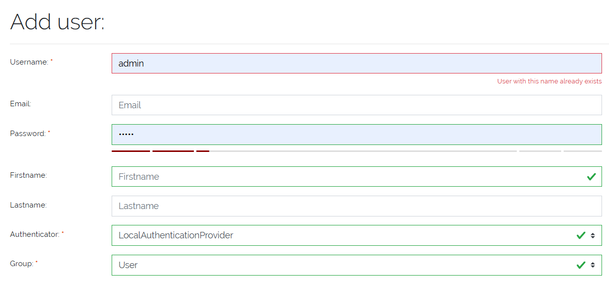

*****
Users
*****

.. _users-anchor:

.. admonition:: Cloud version

    At the current state of development this is not possible in the Cloud Version. Users can only be configured
    inside the **Service Portal**.

Local **Users** can be configured under :menuselection:`Settings --> User`. This section provides a central management interface
to view, create, and manage system users.

All existing users are displayed in a table, showing their basic details. Each user can be edited or deleted via action buttons,
with one exception: the initial **admin** user (identified by the reserved `public_id`) cannot be deleted for security reasons.

| 

=======================================================================================================================

| 

User Creation
=============

To create a new user, click the **"New User"** button. A form will appear where the following fields can be configured:

- **Username**: The unique login name for the user.
- **Firstname**: The first name for the user.
- **Lastname**: The last name for the user.
- **Authenticator**: Determines the login method. Two options are available:
  
  - **Local**: The user logs in with a username and password.
  - **LDAP**: The user is authenticated via an LDAP directory (e.g., Active Directory).
  
- **Password**: Only applicable for users with the local authenticator.
- **Email**: Optional contact information.
- **UserGroup**: Mandatory selection of the group to which the user belongs. Each user must be assigned to at least one
  UserGroup to ensure proper permission control.

    Picure: User creation form

| 

User Restrictions
-----------------

- A user **cannot delete their own account**.
- The **admin user** with a reserved `public_id` is **undeletable** to prevent accidental loss of system access.

