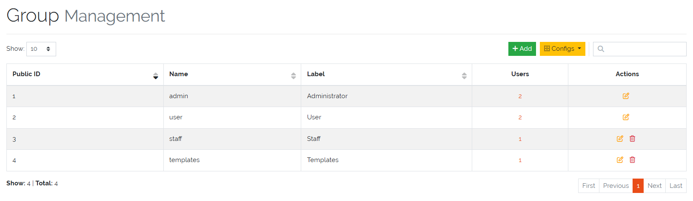
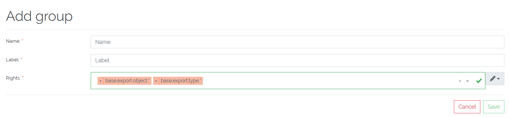

***********
User Groups
***********

.. admonition:: Cloud version

    At the current state of development this is not possible in the Cloud Version

| 

User groups define role-based access within the system. Configuration can be accessed via
:menuselection:`Settings --> Groups`.

    Picure: UserGroup overview

| 

All existing user groups are listed in a management overview, where they can be viewed, edited, or deleted—except for the
two predefined groups:

- **Administrator**
- **Users**

These two groups are system defaults and **cannot be deleted**.

| 

=======================================================================================================================

| 

Creating an UserGroup
=====================

To create a new **UserGroup**, click the **"Add"** button. The following fields must be configured:

- **Name**: The internal identifier of the group.
- **Label**: A human-readable display name.

In addition, the group's **access rights** must be defined to control what :ref:`Users <users-anchor>` in the
**UserGroup** can see and do within the system.

    Picure: UserGroup create form

| 

=======================================================================================================================

| 

Access Rights
=============

Access rights are configured per **UserGroup** and follow a **hierarchical naming structure**. This allows
fine-grained permission control.

A detailed overview of available **Rights** can be viewed under :menuselection:`Settings --> Rights`.

| 

Example Structure:

::

    # General base right
    base.*

    # Rights for framework-level access
    base.framework.*

    # Access to object functionalities
    base.framework.object.*

    # Specific object rights
    base.framework.object.view
    base.framework.object.add

If an **UserGroup** is granted a general right such as `base.framework.object.*`, all child
permissions (e.g. `view`, `add`, `edit`, etc.) are automatically included.

| 

Required Frontend Rights
------------------------

The following minimum **Rights** are required for a **UserGroup** to access and use the frontend
application:

::

    base.framework.object.view
    base.framework.type.view
    base.framework.category.view
    base.framework.log.view
    base.user-management.user.view
    base.user-management.group.view
    base.docapi.template.view
