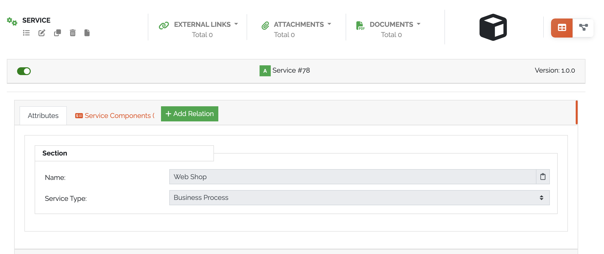
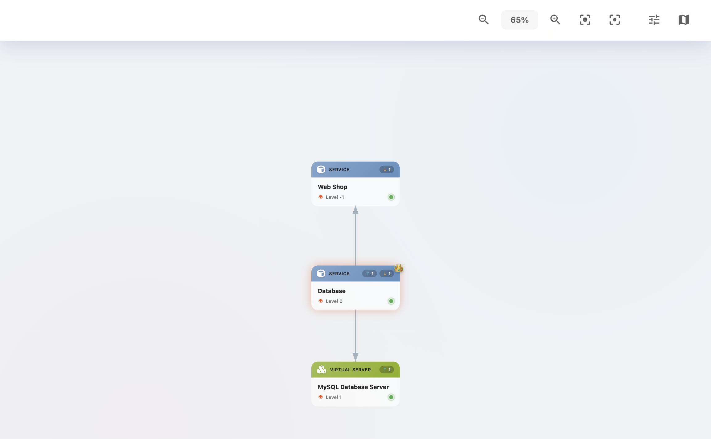
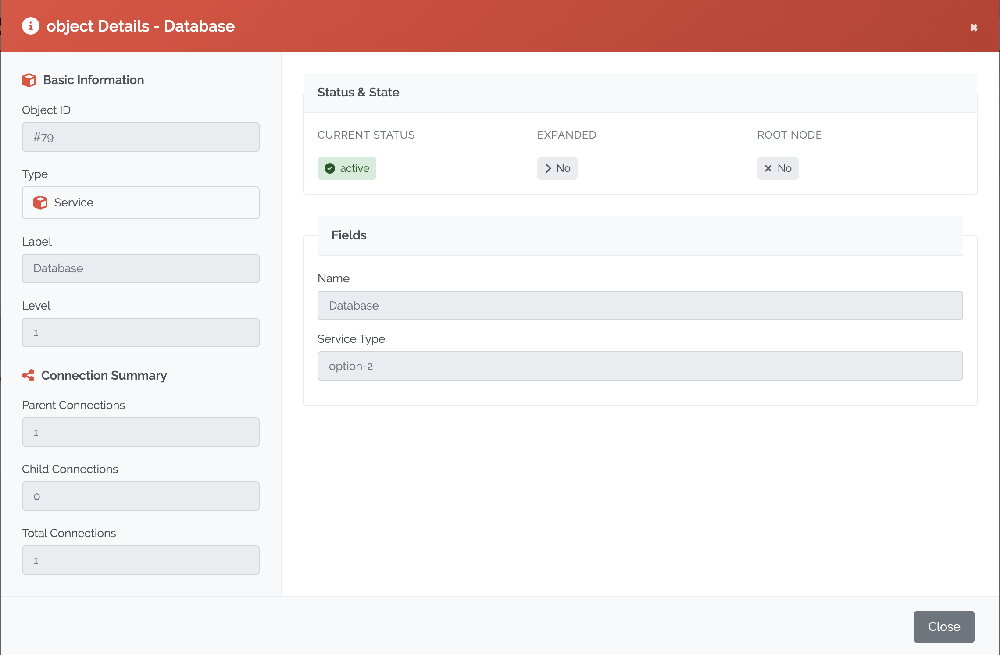
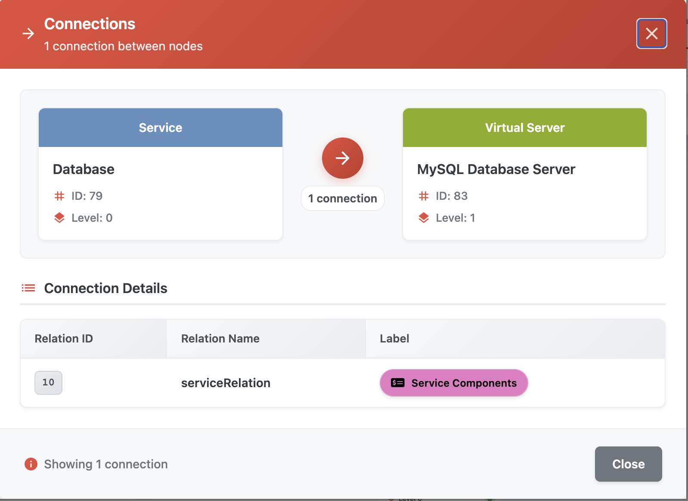
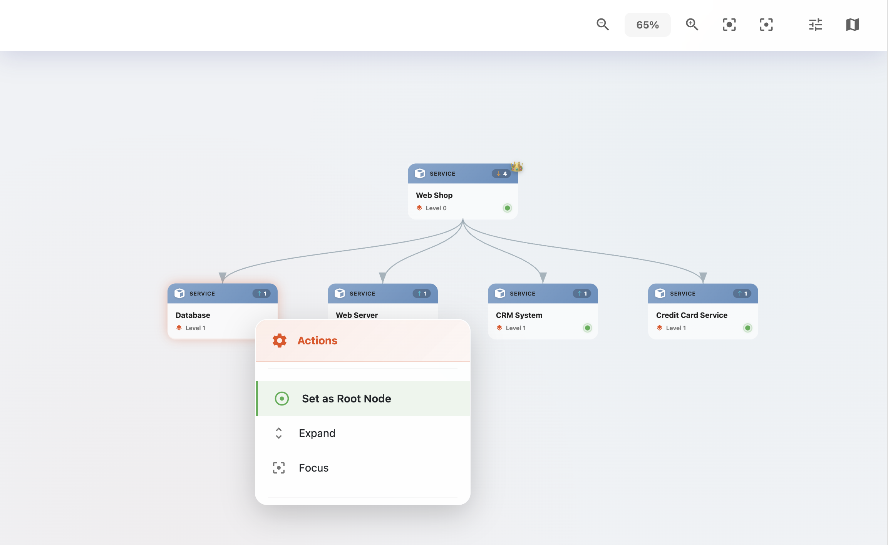
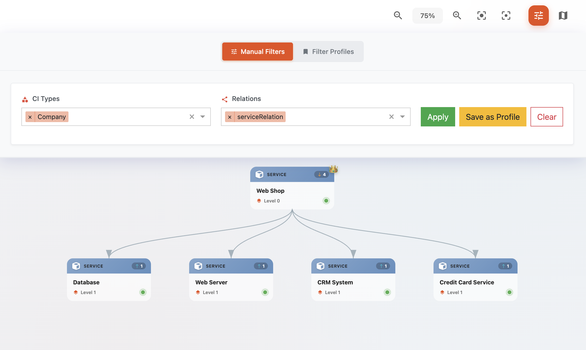
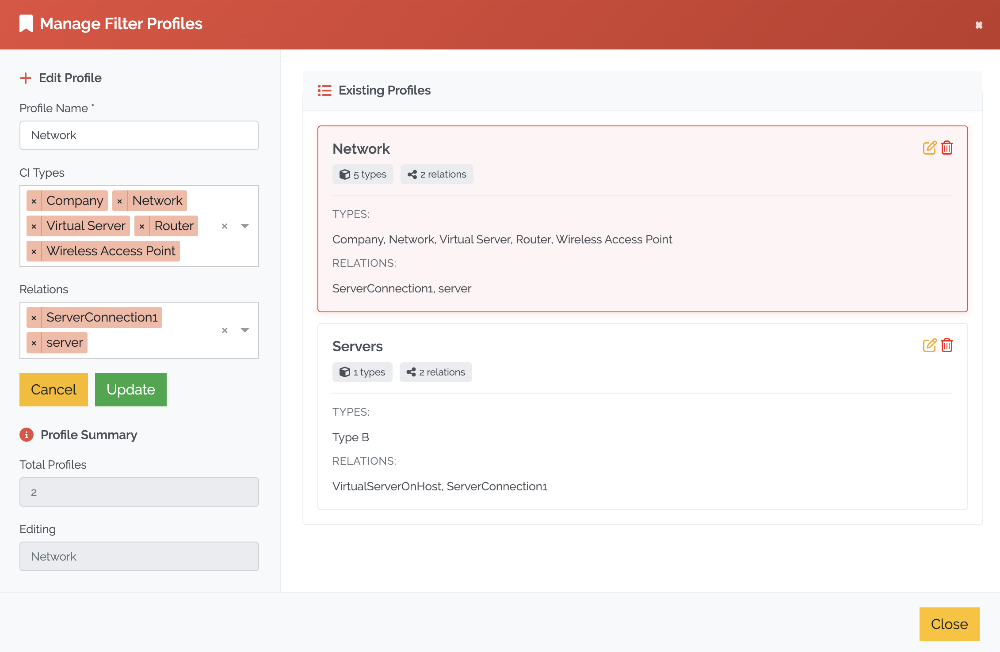

***********
CI Explorer
***********

The **CI Explorer** provides a visual, interactive view of Configuration Item (CI) relationships. It can be accessed
from the **detailed object view** of any existing Object.

The CI Explorer is especially useful for:
- Understanding hierarchical and bidirectional relationships between objects
- Analyzing the impact of a component across multiple layers
- Debugging misconfigurations or relationship errors
- Visual dependency mapping during planning or auditing

To access the CI Explorer press on the most top right icon in the **detailed object view**.

    Picure: **CI Explorer** in **detailed object view**

| 

=======================================================================================================================

| 

Overview
========

Once opened, the CI Explorer displays the currently selected :ref:`Object <objects-anchor>` in the center, with its
related :ref:`Objects <objects-anchor>` arranged in a hierarchical graph:

- **Parent objects** appear above the central :ref:`Object <objects-anchor>`
- **Child objects** appear below the central :ref:`Object <objects-anchor>`

   Picure: **CI Explorer** displaying object relationships

| 

=======================================================================================================================

| 

Interactivity
=============

Each object node in the CI Explorer is clickable:

Clicking an object opens its **object details** in a panel

   Picure: **CI Explorer** object details

| 

Clicking the **arrow** above an object shows a **detailed breakdown of object relationships**

   Picure: **CI Explorer** relationship details

| 

A **right-click context menu** on each object offers the following actions:
  
  - **Set as root node**: Redefine the clicked object as the center of the view
  - **Expand**: Load the next level of relationships for that object
  - **Focus**: Center the view on the clicked object

   Picure: **CI Explorer** object context menu

| 

=======================================================================================================================

| 

Navigation
==========

Each object in the graph is interactive:

- Clicking on a **parent object** loads its own **parents** (one level higher), extending the view upward
- Clicking on a **child object** expands its **children**, extending the view downward

This structure can be expanded **indefinitely**, allowing the user to explore complex object relationship trees
across multiple levels.

| 

=======================================================================================================================

| 

Tools
=====

Located in the **top-right corner** of the CI Explorer interface are several tools to aid navigation and filtering:

- **Zoom In / Zoom Out**: Adjust the zoom level of the graph
  - You can also zoom using the **mouse wheel + Control key**
- **Focus Mode**: Dims the background, highlighting the current object and its relationships
- **Minimap**: Opens an interactive map of the entire CI graph; clicking inside the minimap jumps to the selected location
- **Profile Manager**:
  - Apply filters based on **Types** and **relation types**

| 

=======================================================================================================================

| 

Profile Manager
===============

The **Profile Manager** helps tailor and manage the visual representation of the CI Explorer by applying filters to
Types and relationship types.

   Picure: Profile manager of the **CI Explorer**

**Features:**

- **Filter by Object Types**:
  - Limit which CMDB types are shown (e.g., only Servers or Applications)

- **Filter by Relation Types**:
  - Define which types of relationships should be visualized (e.g., "depends on", "hosts")

- **Save Profiles**:
  - Store current filter settings as reusable profiles

- **Load & Switch Profiles**:
  - Quickly switch between saved configurations for different analysis use cases

- **Manage Profiles**:
  - Rename or delete profiles for easier organization

   Picure: Managing profiles in **Profile manager**

|