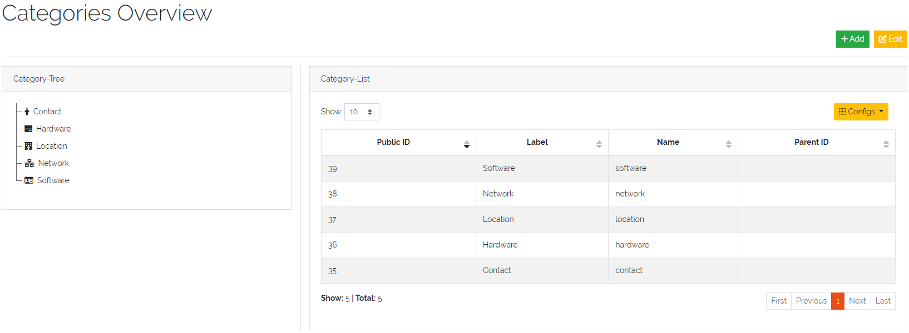
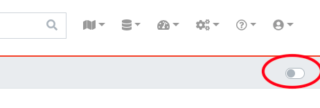

*************
CMDB Concepts
*************

DataGerry is a flexible asset management solution (also known as a **CMDB**) that allows users to build their
own data models by defining custom types. The core unit of data in DataGerry is the :ref:`Object <objects-anchor>`.

An :ref:`Object <objects-anchor>` represents a real-world asset or entity—such as a router, server, building, or service
contract. Each :ref:`Object <objects-anchor>` is based on a :ref:`Type <types-anchor>`, which defines a set of **fields**
representing the attributes of that :ref:`Object <objects-anchor>`. Examples of such fields are:

    * **Hostname** (text)
    * **Maintenance Status** (checkbox)
    * **Location** (dropdown)
    * **Warranty Expiration** (date)

Each field is assigned a specific **data type**, offering a high level of flexibility for modeling any kind of
structured information. This enables teams to manage technical infrastructure, business assets, or virtually
any domain-specific data within a single platform—tailored entirely to their own requirements.

The basic concepts of **Data Structure Modeling** will be explained in more detail
in the upcoming sections.

| 

=======================================================================================================================

| 

=======================================================================================================================

.. _categories-anchor:

Categories
==========

**Categories** in DataGerry are used to organize :ref:`Types <types-anchor>` by grouping them together and enhancing
the organisational overview in the sidebar. They can be structured hierarchically by assigning an existing **Category**
as a parent. To manage **Categories**, navigate to **Framework => Categories**.

| 

**Categories overview**

In the **Categories** overview, you will find the **"Category-Tree"**, which visualizes the current structure of all
**Categories**. The **"Category-List"** provides a detailed view of each existing **Category**, including information
such as PublicID and ParentID. At the top right corner, there are two buttons: the **"Add"** - Button for creating a
new **Category**, and the **"Edit"** - Button for rearranging or deleting existing **Categories** in the
**"Category-Tree"**.

    Picture: Overview of **Categories**

| 

In DataGerry, the tree structure of **Categories** and their assigned :ref:`Types <types-anchor>` is visible in the
sidebar under the **"CATEGORIES"** tab on the left side. Any :ref:`Type <types-anchor>` that is not assigned to a
**Category** appears in the **"UNCATEGORIZED"** section below.

.. figure:: img/categories/categories_sidebar.png
    :width: 200

    Picture: Displayed **Categories** in the Sidebar of DataGerry

| 

=======================================================================================================================

| 

Create a Category
-----------------
To create a new **Category** click the **"+Add"**-Button in the **"Categories Overview"**. All unassigned
:ref:`Types <types-anchor>` are displayed in the left **"Unassigned types"** overview and can be Drag/Dropped into the
**"Types"** area within the **"Basic information"** section. In the **"Basic information"**-Section it is poosible to
set the following properties:

| 

.. list-table:: Table: Fields for **Categories**
   :width: 60%
   :widths: 25 75
   :align: center
   :header-rows: 1

   * - Field
     - Description
   * - Name
     - A unique identifier for the **Category**
   * - Label
     - The displayed label of the **Category**
   * - Icon
     - The icon of the **Category** is displayed in various views , such as the sidebar
   * - Parent
     - Select the top **Category** if this one should be a sub **Category**
   * - Types
     - Drag/Drop **Types** in this section which should be grouped by this **Category**

| 

.. figure:: img/categories/categories_add.png
    :width: 1000

    Picture: Adding a **Category**

| 

=======================================================================================================================

| 

Edit/Delete a Category
----------------------
To edit a **Category** press the **"Edit"**-Button  located in the top right corner of the **"Categories View"**.
This action will toggle the display of the **"Category-Tree"** section. Within this view, you can rearrange
the order of **Categories** by dragging and dropping the icon to the right of the **Category** - Label. Each
**Category** is accompanied by two actions: accessing its **'Edit'** form or deleting it (by clicking the
**Trash Bin** - Icon).

.. note::
    Deleting a **Category** will not delete the assigned **Types**.

.. figure:: img/categories/categories_edit_tree.png
    :width: 1000

    Picture: Edit a **Category** in **"Category-Tree"**

| 

When editing a **Category** within the **"Edit"**-Form you can additionaly rearange the order of the assigned
**Types** as well as modify the assignments.

.. figure:: img/categories/categories_edit_form.png
    :width: 1000

    Picture: Edit a **Category** in **"Edit"**-Form

| 

=======================================================================================================================

| 

=======================================================================================================================

.. _types-anchor:

Types
=====

| 

**Types** are structured entities that enclose various sections, each containing specific fields. These fields are
designed to capture and describe the attributes and characteristics of real-world objects. By organizing information
into sections, **Types** provide a systematic way to represent complex :ref:`Objects <objects-anchor>` and their
properties, ensuring consistency and clarity in data management.

**Types** serve as blueprints for :ref:`Objects <objects-anchor>`, defining the structure and characteristics each  
:ref:`Object <objects-anchor>` can possess. In other words, a **Type** specifies the fields and
potential values that an :ref:`Object <objects-anchor>` can include, ensuring that all :ref:`Objects <objects-anchor>`
of a particular **Type** adhere to a consistent format and set of attributes.

To manage **Types** click **Framework -> Types** in the top right corner.

.. figure:: img/types/types_open_menu.png
    :width: 200

    Picture: Open **Types** management

| 

=======================================================================================================================

| 

Adding a Type
-------------
The type list (**Framework -> Types**) provides an overview of all the **Types** created so far, displayed in a table
format. Above the table, there is an **"Add"** button, which opens a form for creating a new **Type**. The form consists
of several steps.

| 

**Step 1 - Basic information**

In this step you need to provide some basic information about the type:

- **Name**: A unique identifier for the **Type**
- **Label**: The displayed label of the **Type**
- **Icon**: Select an icon for the **Type** by double clicking in the name (**"fa fa-cube"**) of the default icon

Once you have completed these fields, press the **"Next Step"** button to proceed to the next step.

| 

.. figure:: img/types/types_create_basic_information_step.png
    :width: 800

    Picture: Type creation - Step 1

| 

**Step 2 - Content**

In this step all sections and their correspondig fields are defined for the type. In the left sidebar are several
expandable elements which provide components to build up a type by drag and drop these components inside the area
in the center:

- **Global Section Templates**: For more infomation about this section see this link:
  :ref:`Section Templates <section-templates-anchor>`
- **Section Templates**: For more infomation about this section see this link:
  :ref:`Section Templates <section-templates-anchor>`
- **Structure Controls**: These components group fields. Fields can only be placed inside of
  these **Structure Controls**. More details can be found in the table below.
- **Basic Controls**: These components are the fields with different data formats. They need to be dragged and
  dropped inside of **Structure Controls**. More details are in the table below.
- **Special Controls**: These components are also fields but with a specific purpose. More details are in the table
  below.

| 

.. note::
  After you finished Step 1 and 2, the **Type** can be saved. Steps 3 and 4 are optional to configure.

| 

.. figure:: img/types/types_create_content_step.png
    :width: 800

    Picture: Definition of fields for **Type** - Step 2

| 

.. list-table:: Table: Structure Controls
   :width: 80%
   :widths: 15 85
   :align: left
   :header-rows: 1

   * - Type
     - Description
   * - Section
     - A container used to group fields
   * - Multi Data Section
     - Allows saving multiple values for the defined fields. See more: :ref:`Multi Data Sections <mds-anchor>`
   * - Reference Section
     - Binds a section with all fields of a referencing object completely as a display. The search for
       the field values is run through like a normal field. The references are expanded accordingly, so
       that a distinction is made between field references and section references.

| 

.. figure:: img/types/types_reference_section.png
    :width: 600

    Picture: Definition of the object fields via reference section

| 

.. list-table:: Table: Basic and Special Controls
   :width: 80%
   :widths: 15 85
   :align: left
   :header-rows: 1

   * - Type
     - Description
   * - Text
     - A text field. Content validation with regular expression is possible
   * - Number
     - A numeric field. Only accepts numbers a input
   * - Password
     - password field with integrated password generator and hiding of content
   * - Textarea
     - Textbox with multiple lines
   * - Checkbox
     - A checkbox used to store a True or False value
   * - Radio
     - Selection between multiple options
   * - Select
     - Selection between multiple options with a dropdown menu
   * - Date
     - A Date picker
   * - Reference
     - Reference to another :ref:`Object <objects-anchor>` of a specific **Type**. E.g. connection between a PC and
       a hard drive. Embeds a summary of a referencing :ref:`Object <objects-anchor>` as a display. The summary for
       each object definition is predefined in the type configuration under the **“Meta”** step. With the field type
       “Reference” it is possible to override the predefined summaries and make them user specific.
   * - Location
     - Can be only used once per **Type**. Follow this link for more information: :ref:`Locations <locations-anchor>`

| 

.. figure:: img/types/types_special_control_field.png
    :width: 600

    Picture: Special Control - Reference

| 

**Step 3 - Meta(Optional)**

In this step the meta information of the **Type** can be set. Each object can have summary fields. These fields
summarize the :ref:`Object <objects-anchor>` and are shown by default in object lists. On a router, this could be a
management ip and a hostname. The summary fields can be set under **“Summary”**. Also, external links can be set,
which are shown on the object page to add a quick link to the WebUI of another system. An External Link has a name,
a label, an icon and the link (URL) itself. In the link, use curved brackets to access values of an
:ref:`Object <objects-anchor>` field.

| 

.. figure:: img/types/types_create_meta_step.png
    :width: 600

    Picure: Meta information of a **Type**

| 

**Step 4 - ACL (Optional)**

In this step advanced permissions can be set for this **Type**. The default setting is set to "ACL deactivated".
More information to this topic at this link: :ref:`Access Control List <access-control-list-anchor>`

| 

.. figure:: img/types/types_create_acl_step.png
    :width: 600

    Picure: ACL settings for the **Type**

| 

=======================================================================================================================

| 

Editing/Deleting a Type
-----------------------

The type list (**Framework => Types**) table itself contains, apart from several useful information about the created
**Types**, two columns in the end with **"Actions"** and **"Clean"**. In the **"Actions"** column it is possible to
edit, clone or delete the existing **Types**.

.. warning::
  A **Type** can only be deleted if there are no exisitng :ref:`Objects <objects-anchor>` of this **Type**

| 

In the **"Clean"** column is a button which will turn red and state **"Unclean"** if you change the **Type** schema
(by adding or deleting fields/sections) This happens only if there is at least one :ref:`Object <objects-anchor>` of
this **Type**. By pressing the **"Unclean"**-Button it lets you update all your created :ref:`Objects <objects-anchor>`
of this **Type** with the changes you applied on the **Type** (for example a newly added field to the **Type** will be
added to all existing :ref:`Objects <objects-anchor>` of that **Type**).

.. figure:: img/types/types_overview.png
    :width: 600

    Picure: **Types** overview table

| 

=======================================================================================================================

| 

=======================================================================================================================

.. _objects-anchor:

TODO: Objects
=============

You can access Objects in DataGerry in several ways:

 * using the Category tree on the left side
 * using the search bar at the top

When using the Category tree, you can choose a :ref:`Type <types-anchor>` (e.g. Router) and get a list with all
**Objects** of that :ref:`Type <types-anchor>`. By default, only summary fields of an **Object** are shown in the
table, with the yellow settings button, additional fields can be faded in.

| 

=======================================================================================================================

| 

Active und Inactive Objects
---------------------------
**Objects** in DataGerry can be active or inactive. Inactive **Objects** are hidden in the WebUI. By default, all new
created **Objects** in DataGerry are active. You can set an **Object** to inactive by hitting the small switch on the
Object view page.

If you want to see inactive Objects in the WebUI, click on the switch under the navigation bar.

    Figure 8: Active / Inactive **Objects** switch

| 

=======================================================================================================================

| 

Object tables search / filter
-----------------------------

Searching a table is one of the most common user interactions with a DataGerry table, and DataGerry provides a number
of methods for you to control this interaction. There are tools for the table search(search) and for each individual
column (filter). Each search (table or column) can be marked as a regular expression (allowing you to create very complex
interactions).

| 

Please note that this method only applies the search to the table - it does not actually perform the search.

| 

.. figure:: img/objects/object_table_search_initial.png
    :width: 600

    Figure 9: Unfiltered object overview

| 

**Table search**

The search option offers the possibility to check the results in a table.
The search is performed across all searchable columns. If matching data is found in a column,
the entire row is matched and displayed in the result set. See Figure 10: *Search result after searching for "B"*

.. figure:: img/objects/object_table_search_result.png
    :width: 600

    Figure 10: Search result after searching for "B"

| 

**Table filter**

While the search function offers the possibility to search the table,
the filter method provides the ability to search for data in a specific column.

The column searches are cumulative, so additional columns can be inserted to apply multiple individual column searches,
presenting the user with complex search options.

.. figure:: img/objects/object_table_filter_result.png
    :width: 600

    Figure 11: Filter result after filtering for "B"

| 

The search terms within different rows are linked with each other with the condition *OR*
(Figure 12: *Filtering by OR-expression*). The search terms within a row are all linked with the condition *AND*
(Figure 13: *Filter by AND-expression*). Only the filtered **Objects** are available for exporting the values
from the current table.

    Figure 12: Filtering by OR expression

| 

.. figure:: img/objects/object_table_filter_example_2_result.png
    :width: 600

    Figure 13: Filtering by AND expression

|

.. note::
    Date values must be searched according to the following format:

    **Format**: *YYYY-MM-DDThh:mmZ*

    **Example**: *2019-12-19T11:02*

| 

=======================================================================================================================

| 

Bulk change of Objects
----------------------
The bulk change is a function in DataGerry with which several **Objects** can be changed in one step on the basis of
change templates. With this change, the selected **Objects** adopt the field values of the change template.

**Start**

Simply select all **Objects** you want to change and click on the yellow button for mass changes above the list.

    Figure 14: Select objects for bulk change

**Template**

A change template is generated based on the assigned :ref:`Type <types-anchor>`. The following change template is
identical to the creation of a regular **Object**. Store all contents that you want to transfer to the **Objects**
later and save your entries.

.. figure:: img/objects/objects_bulk_change_active.png
    :width: 600

    Figure 15: Change template

**Preview**:

In the preview, all changes made are listed and can be adjusted again if necessary.

.. figure:: img/objects/objects_bulk_change_preview.png
    :width: 600

    Figure 16: Overview of changes

**Result**:

After a preview, the selected objects will be changed.

    Figure 17: Bulk change result

| 

=======================================================================================================================

| 

=======================================================================================================================

| 

ObjectGroups
============

| 

.. note::
  As of **Version 3.0.0**, **ObjectGroups** are currently only utilized by the :ref:`ISMS <isms-anchor>` functionality.
  Integration with other areas of DataGerry is planned for future releases.

| 

**ObjectGroups** provide a powerful way to logically group related configuration items (CIs) in the CMDB, making
management, documentation, and analysis significantly more efficient.

**Benefits**

- **Simplified Management**: **ObjectGroups** enable administrators to work with collections of
  :ref:`Objects <objects-anchor>` as a single entity, improving clarity and reducing complexity when handling
  infrastructure components.
- **Improved Visibility**: By grouping related :ref:`Objects <objects-anchor>` (e.g., servers, load balancers,  
  databases) under a common service or application context, dependencies and relationships become more transparent.
- **Flexible Grouping**: 
  - *Static Groups*: Multiple specific :ref:`Objects <objects-anchor>` are explicitly assigned to the **ObjectGroup**,
  giving full manual control.
  - *Dynamic Groups*: Entire :ref:`Types <types-anchor>` are assigned, and all :ref:`Objects <objects-anchor>` of
  those :ref:`Types <types-anchor>` automatically belong to the **ObjectGroup**. This is ideal for environments with
  frequent changes.
- **Categorization Support**: Multiple category tags can be assigned to an **ObjectGroup**, helping to organize and
  filter
  **ObjectGroups** by business area, service level, environment (e.g., production or staging), and more.
- **Better Impact Analysis**: Understanding the full scope of a service or application is easier when all relevant  
  :ref:`Objects <objects-anchor>` are grouped together, especially during incidents or planned maintenance.

| 

To access **ObjectGroups**, navigate to **Framework -> ObjectGroups**. This section provides a tabular overview of
all existing **ObjectGroups**. Above the table, you'll find an **"Add"** button, which opens a form for creating a
new **ObjectGroup**. In the **Actions** column, you can edit or delete existing **ObjectGroups**.

.. figure:: img/object_groups/object_groups_overview.png
    :width: 600

    Picure: **ObjectGroups** overview table

| 

=======================================================================================================================

| 

Adding an ObjectGroup
---------------------

| 

To add a new **ObjectGroup**, go to **Framework -> ObjectGroups** and click the **"Add"** button to open the creation
form. There are two types of **ObjectGroups**:

- **Static** groups, which contain multiple :ref:`Objects <objects-anchor>`
- **Dynamic** groups, which include multiple :ref:`Types <types-anchor>` and automatically group all existing
  :ref:`Objects <objects-anchor>` of those :ref:`Types <types-anchor>`

| 

.. list-table:: Table: Fields for **ObjectGroups**
   :width: 60%
   :widths: 25 75
   :align: center
   :header-rows: 1

   * - **Group Name**
     - The display name of the **ObjectGroup**
   * - **Group Type**
     - The group mode:
       - *Static*: Manually assigned :ref:`Objects <objects-anchor>`
       - *Dynamic*: All :ref:`Objects <objects-anchor>` from selected :ref:`Types <types-anchor>`
   * - **Categories**
     - Tags that can be assigned to organize or label the **ObjectGroup**
   * - **Assigned Objects**
     - Depending on the group type, either selected :ref:`Objects <objects-anchor>` or :ref:`Types <types-anchor>`

| 

.. figure:: img/object_groups/object_groups_create.png
    :width: 600

    Picure: **ObjectGroups** creation form

| 

**Adding Categories to ObjectGroups**

Categories can be assigned to **ObjectGroups** to help organize and filter them effectively. To manage these
categories, click the **"Manage Categories"** button. Categories created here are global and shared across
all **ObjectGroups**.

| 

.. figure:: img/object_groups/object_groups_manage_categories.png
    :width: 600

    Picure: **ObjectGroups** categories management

| 

=======================================================================================================================

| 

=======================================================================================================================

| 

Persons
=======

.. _persons-anchor:

| 

.. note::
  As of **Version 3.0.0**, **Persons** are currently only utilized by the :ref:`ISMS <isms-anchor>` functionality.
  Integration with other areas of DataGerry is planned for future releases.

| 

The **Persons** section in DataGerry provides a way to model real-world individuals relevant to your organization
or processes. These are **not** users of the DataGerry frontend and do **not** represent login accounts, but rather
describe people who are referenced in documentation, responsibilities, or compliance records —
such as employees, external contacts, or role-holders.

To access **Persons**, navigate to **Framework -> Persons**. This area displays a tabular overview of all defined
**Persons**, with options to **Add**, **Edit**, or **Delete** entries.

| 

.. figure:: img/persons/persons_overview.png
    :width: 600

    Picure: **Persons** overview table

| 

=======================================================================================================================

| 

Adding a Person
---------------

| 

To add a new **Person**, go to **Framework -> Persons** and click the **"Add Person"** button to open the creation
form.

| 

.. list-table:: Table: Fields for **Persons**
   :width: 60%
   :widths: 25 75
   :align: center
   :header-rows: 1

   * - **First Name**
     - The given name of the **Person**
   * - **Last Name**
     - The family name or surname of the **Person**
   * - **Display Name**
     - *(Read-only)* – Automatically generated as "<FirstName> <LastName>", used when referencing the **Person**
       in other parts of the system
   * - **Phone Number**
     - Phone number of the **Person**
   * - **Email**
     - Email address of the **Person**
   * - **Groups**
     - Assigned :ref:`PersonGroups <person-groups-anchor>` that this **Person** belongs to

.. note::
    When a **Person** is created, they are automatically linked to all selected
    :ref:`PersonGroups <person-groups-anchor>`

| 

.. figure:: img/persons/persons_create.png
    :width: 600

    Picure: Create a **Person** form

| 

=======================================================================================================================

| 

=======================================================================================================================

| 

PersonGroups
============

.. _person-groups-anchor:

| 

.. note::
  As of **Version 3.0.0**, **PersonGroups** are primarily used in the context of the :ref:`ISMS <isms-anchor>`
  functionality. Integration with other modules is planned for future releases.

| 

**PersonGroups** allow you to logically group multiple :ref:`Persons <persons-anchor>` for use in responsibilities,
audits, and documentation. These groups can represent departments, teams, or role-based clusters of individuals.

To access **PersonGroups**, navigate to **Framework -> PersonGroups**. This section provides a tabular overview of all
existing groups, along with options to **Add**, **Edit**, or **Delete** entries.

| 

.. figure:: img/person_groups/person_groups_table.png
   :width: 600

   Picture: **PersonGroups** overview table

| 

=======================================================================================================================

| 

Adding a PersonGroup
---------------------

| 

To create a new **PersonGroup**, go to **Framework -> PersonGroups** and click the **"Add PersonGroup"** button to open
the creation form.

| 

.. list-table:: Table: Fields for **PersonGroups**
   :width: 60%
   :widths: 25 75
   :align: center
   :header-rows: 1

   * - **Group Name**
     - The name of the **PersonGroup**
   * - **Email**
     - A shared or representative email address for the group (optional)
   * - **Group Members**
     - A list of :ref:`Persons <persons-anchor>` who are part of this group

.. note::
   When a **PersonGroup** is created or modified, its members are automatically synchronized with the corresponding
   :ref:`Persons <persons-anchor>`, ensuring that group assignments remain consistent across the system.

| 

   Picture: Create a **PersonGroup** form

|