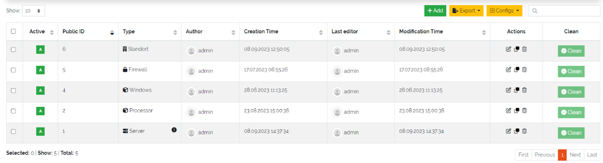

*******************
DataGerry Assistant
*******************

The **DataGerry Assistant** provides an intuitive and guided setup to help you get started quickly. It launches
automatically the first time you open DataGerry, but you can also start it manually at any time via
**Toolbox ⇒ Assistant** in the top-right menu.

    Picture: Assistant in Toolbox

| 

=======================================================================================================================

Once launched, the Assistant presents you with a list of common **branches** typically used in CMDB structures
(e.g., IT infrastructure, facilities). You may select one or multiple branches depending on your use case.

.. figure:: img/dg_assistant/assistant_branches.png
    :width: 700
    :alt: Branch selection

    Picture: Branch selection

| 

=======================================================================================================================

After choosing your branches, click **Continue** to proceed to the **profile selection** step. Profiles are
collections of predefined :ref:`Types <types-anchor>` commonly associated with the selected branches. You can refine
your setup by enabling or disabling individual profiles.

.. figure:: img/dg_assistant/assistant_profiles.png
    :width: 700
    :alt: Profile selection

    Picture: Profile selection

| 

=======================================================================================================================

Clicking **Create** will automatically generate all :ref:`Types <types-anchor>` defined in your selected profiles. Once
the :ref:`Types <types-anchor>` are created, you’ll be redirected to the **Type Overview**, which can also be accessed
later via **Framework ⇒ Types**.

In the sidebar, your new :ref:`Types <types-anchor>` will appear under **Categories**, organized according to the
branches and profiles you selected.

    Picture: Type overview table

| 

=======================================================================================================================

In the **Type Overview** table, you can explore and modify any generated :ref:`Type <types-anchor>` by clicking the
**Edit** icon under the **Actions** column. This gives you a closer look at how :ref:`Types <types-anchor>` are
structured within DataGerry.

You can also define your own :ref:`Types <types-anchor>` from scratch using the **+ Add** button above the
table—tailoring the system precisely to your needs.

.. figure:: img/dg_assistant/assistant_type_editing.png
    :width: 1000
    :alt: Type editing form

    Picture: Type editing form

| 