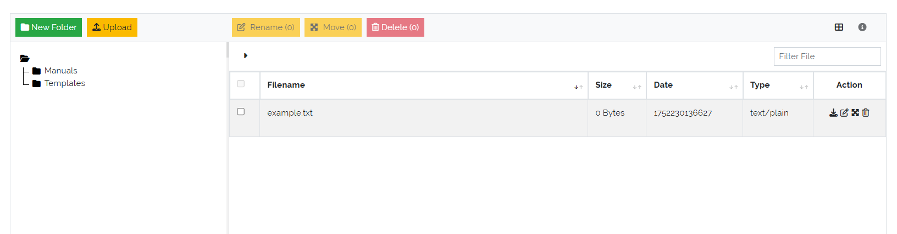

*************
File Explorer
*************

.. _file-explorer-anchor:

The **File Explorer**, accessible via :menuselection:`Toolbox --> Explorer`, provides a structured interface for
managing files and folders within the system. It enables users to upload, organize, and maintain documents and
related resources in a hierarchical folder tree.

| 

=======================================================================================================================

| 

Overview
========

The interface is split into two main sections:

- **Left Pane**: Displays a tree structure of folders. Initially, only the root folder is visible.
- **Right Pane**: Displays a list of files contained in the currently selected folder.

    Picure: **File Explorer** overview

| 

Folder Management
-----------------

Above the folder tree are two action buttons:

- **New Folder**: Creates a subfolder within the currently selected folder.
- **Upload**: Uploads one or more files into the currently selected folder.

Users can build and maintain a hierarchical folder structure suitable for organizing project documentation,
templates, evidence files, and more.

| 

File and Folder Operations
--------------------------

The following actions are available for both files and folders:

- **Edit**: Rename folders or update file metadata.
- **Move**: Reorganize content by moving files and folders to different locations within the tree.
- **Delete**: Permanently removes a file or folder.

.. warning::

   Deleting a folder will **also delete all its contents**, including any subfolders and files. This action
   is irreversible and should be done with caution.

| 

Benefits
--------

- Centralized storage of ISMS documentation and artifacts.
- Easy navigation through a structured folder hierarchy.
- Quick upload and retrieval of compliance evidence or working documents.
- Intuitive UI for file and folder management.