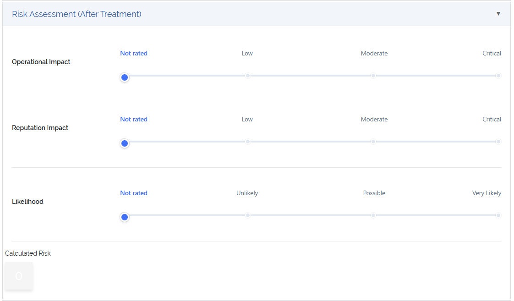

****
ISMS
****

.. _isms-anchor:

.. contents:: Table of Contents
    :local:

=======================================================================================================================

An **Information Security Management System (ISMS)** is a structured framework of policies, processes, and controls
designed to manage and protect an organization's sensitive data and information assets. It ensures that
information security risks are identified, evaluated, and mitigated systematically across all areas of the
organization.

The goal of an ISMS is not only to prevent data breaches or unauthorized access, but also to maintain the
confidentiality, integrity, and availability of information — often referred to as the **CIA triad**.

An effective ISMS is aligned with international standards such as **ISO/IEC 27001** and provides the foundation
for establishing trust, meeting regulatory compliance requirements, and ensuring continual improvement of security
posture.

Key elements of an ISMS include:

* **Risk Management** - Identifying, evaluating, and addressing security risks
* **Policies and Procedures** - Documenting rules and processes for information security
* **Roles and Responsibilities** - Defining who is accountable for different areas of security
* **Asset Management** - Tracking and classifying information assets and their importance
* **Incident Management** - Preparing for and responding to security breaches and incidents
* **Continual Improvement** - Regularly assessing and enhancing the ISMS based on audits and feedback

| 

The ISMS implementation in **DataGerry** supports organizations in modeling these concepts and maintaining
a centralized system to manage security-related documentation, responsibilities, risks, and controls.

To access the ISMS functionalities of DataGerry go to **Toolbox -> ISMS**.

.. figure:: img/isms/isms_overview.png
    :width: 600

    Picture: ISMS overview

In the following sections, you will find detailed explanations of how ISMS-related features are integrated into
DataGerry.

| 

=======================================================================================================================

| 

ISMS - Configuration
====================

Before risks can be assessed and treated effectively, an Information Security Management System (ISMS) requires a solid
foundation of clearly defined classification schemes and evaluation parameters. In DataGerry, the ISMS Configuration
provides the necessary building blocks for a consistent and repeatable risk assessment process.

This configuration defines how risks are identified, scored, and categorized, and it forms the basis for generating a
standardized **Risk Matrix**. It enables organizations to align their risk evaluation with internal policies or
external frameworks.

The following elements are part of the ISMS Configuration:

* **Risk Classes** - Define how risk levels are grouped and labeled (e.g., Low, Medium, High)
* **Likelihoods** - Represent the probability of a risk event occurring
* **Impacts** - Describe the potential consequences or severity if a risk occurs
* **Impact Categories** - Break down impacts into specific domains (e.g., Financial, Legal, Operational)
* **Protection Goals** - Define which security objectives are affected (e.g., Confidentiality, Integrity, Availability)
* **Risk Matrix** - Combines likelihoods and impacts to determine overall risk levels based on the configured classes

These configuration elements are used throughout the ISMS functionality of DataGerry to evaluate risks, document their
relevance, and decide on appropriate treatment strategies.

In the next sections, each of these configuration areas will be described in detail, including their purpose and how
they are managed in the system.

To access the ISMS Configuration go to **Toolbox -> Configure ISMS Settings**

| 

=======================================================================================================================

| 

Risk classes
------------

.. _isms-risk-class-anchor:

| 

Risk Classes (or Risk Levels) define how calculated risks are categorized within the ISMS framework.
They represent the severity or urgency of a given risk and are essential for supporting risk-based
decision-making.

Each class groups a range of risk scores and gives them a human-readable meaning — for example: *Low*,
*Medium*, or *High*. These labels are later used throughout the ISMS process to guide mitigation
priorities, reporting, and compliance evaluations.

To access and manage Risk Classes, navigate to **Toolbox -> Configure ISMS Settings -> Risk Classes**.

.. figure:: img/isms/isms_risk_classes_overview.png
    :width: 600

    Picture: ISMS risk classes overview

| 

**Minimum and Maximum Limits**

- A minimum of **three (3)** risk classes is required to enable the ISMS risk evaluation process
- A maximum of **six (6)** risk classes can be defined to keep evaluations consistent and manageable

| 

**Risk class fields**

Each Risk Class includes the following fields:

.. list-table:: Table: Fields for Risk Classes
   :width: 80%
   :widths: 30 70
   :align: center

   * - **name**
     - The name or title of the Risk Class (e.g., *Low*, *Moderate*, *Critical*)
   * - **Color**
     - A visual color indicator used in risk matrices and tables for intuitive representation
   * - **Description**
     - The description of the risk class

.. figure:: img/isms/isms_risk_classes_create.png
    :width: 600

    Picture: ISMS risk classes create form

| 

=======================================================================================================================

| 

Likelihoods
-----------

.. _isms-likelihood-anchor:

| 

Likelihoods represent the probability that a specific risk scenario will occur. Within the ISMS framework, likelihood
is one of the two primary dimensions (alongside impact) used to calculate overall risk severity. Proper definition
of likelihood levels ensures consistent and repeatable risk assessments across the organization.

To manage **Likelihoods**, navigate to **Toolbox -> Configure ISMS Settings -> Likelihoods**.

    Picture: ISMS likelihoods overview

| 

**Minimum and Maximum Limits**

- A minimum of **three (3)** likelihood levels is required for the risk matrix to function correctly
- A maximum of **six (6)** likelihood levels can be defined

| 

**Likelihood fields**

Each **Likelihood** includes the following fields:

.. list-table:: Table: Fields for Likelihoods
   :width: 80%
   :widths: 30 70
   :align: center

   * - **Name**
     - The name of the Likelihood level (e.g., *Unlikely*, *Possible*, *Very Likely*)
   * - **Description**
     - The description of the **Likelihood**
   * - **Calculation Basis**
     - A numeric value representing the likelihood's weight; used in risk score calculations

.. figure:: img/isms/isms_likelihood_create.png
    :width: 600

    Picture: ISMS likelihood create form

| 

.. note::
   **Likelihoods** are used in combination with :ref:`Impacts <isms-impact-anchor>` to determine a total risk score,
   which is then categorized using the defined :ref:`Risk Classes <isms-risk-class-anchor>`

| 

=======================================================================================================================

| 

Impacts
-------

.. _isms-impact-anchor:

| 

Impacts represent the severity of consequences that would result if a given risk scenario occurs. Together with
:ref:`Likelihoods <isms-likelihood-anchor>`, impacts form the basis of risk evaluation and define how critical a risk
is to your organization. Well-defined impact levels help ensure a consistent and objective assessment process.

To manage **Impacts**, navigate to **Toolbox -> Configure ISMS Settings -> Impacts**.

    Picture: ISMS impacts overview

| 

**Minimum and Maximum Limits**

- A minimum of **three (3)** impact levels is required for the risk matrix to function correctly
- A maximum of **six (6)** impact levels can be defined

| 

**Impact fields**

Each **Impact** includes the following fields:

.. list-table:: Table: Fields for Impacts
   :width: 80%
   :widths: 30 70
   :align: center

   * - **Name**
     - The name of the Impact level (e.g., *Low*, *Moderate*, *Critical*)
   * - **Description**
     - A brief explanation of the potential consequence or damage for this impact level
   * - **Calculation Basis**
     - A numeric value representing the severity of the impact; used in risk score calculations

    Picture: ISMS impact create form

| 

.. note::
   **Impacts** are used in combination with :ref:`Likelihoods <isms-likelihood-anchor>` to determine the overall risk
   score, which is then classified using defined :ref:`Risk Classes <isms-risk-class-anchor>`

| 

=======================================================================================================================

| 

Impact Categories
-----------------

.. _isms-impact-categories-anchor:

**Impact Categories** allow organizations to group different dimensions of potential impact for use in risk assessments.
They provide context to the selected **Impact levels** by defining what a certain severity means in specific areas —
such as financial damage, regulatory consequences, or business continuity.

To manage **Impact Categories**, navigate to **Toolbox -> Configure ISMS Settings -> Impact Categories**.

.. figure:: img/isms/isms_impact_categories_overview.png
    :width: 600

    Picture: ISMS impact categories overview

| 

**Impact Category fields**

Each **Impact Category** consists of the following fields:

.. list-table:: Table: Fields for Impact Categories
   :width: 90%
   :widths: 30 70
   :align: center

   * - **Impact Category Name**
     - The name of the category (e.g., *Financial*, *Legal*, *Operational*)
   * - **Impact Descriptions**
     - A list of descriptions for each defined :ref:`Impact <isms-impact-anchor>`, describing what each level
       means within this category's context

.. figure:: img/isms/isms_impact_categories_create.png
    :width: 600

    Picture: ISMS impact categories create form

| 

.. note::
   Each **Impact Category** can provide a textual description for every existing **Impact**, allowing
   risk assessors to understand the consequences within that category's scope.

| 

=======================================================================================================================

| 

Protection Goals
----------------

|

**Protection Goals** define the core security objectives your organization aims to uphold when managing risks.
These goals serve as key pillars in risk analysis and help determine the impact of specific threats on critical
information assets.

In DataGerry's ISMS module, three **Protection Goals** are predefined:

- **Confidentiality** - Ensuring that sensitive information is accessible only to authorized parties.
- **Integrity** - Ensuring the accuracy and reliability of information and systems.
- **Availability** - Ensuring that systems and data are accessible when needed.

You may also define additional custom Protection Goals to reflect your organization's specific requirements
(e.g., *Authenticity*, *Traceability*, *Resilience*).

To manage **Protection Goals**, navigate to: **Toolbox -> Configure ISMS Settings -> Protection Goals**

    Picture: ISMS protection goal overview

| 

.. note::
    Each **Protection Goal** consists of a single field (name)

| 

=======================================================================================================================

| 

Risk Matrix
-----------

| 

The **Risk Matrix** is the core mechanism used in the ISMS module to determine the severity of risks by evaluating
the :ref:`Likelihood <isms-likelihood-anchor>` of an event occurring against its potential
:ref:`Impact <isms-impact-anchor>`. The result is a :ref:`Risk Class <isms-risk-class-anchor>` that reflects
the criticality of the risk and guides appropriate mitigation measures.

|

To configure the Risk Matrix, navigate to: **Toolbox -> Configure ISMS Settings -> Risk Calculation**

    Picture: ISMS risk matrix overview

|

**Matrix Configuration**

A 2-dimensional matrix is displayed with:

- :ref:`Likelihoods <isms-likelihood-anchor>` on the Y-axis
- :ref:`Impacts <isms-impact-anchor>` on the X-axis

Each cell in the matrix represents a possible combination of Likelihood and Impact. The user simply selects a **Risk Class**
for each combination — the structure of the matrix and the scoring logic are calculated automatically by the system.

This visual structure enables quick assessment and classification of risks based on their severity, using predefined logic.

| 

.. note::
   The number of rows and columns in the matrix is determined by the number of Likelihoods and Impacts defined
   in your ISMS configuration. Make sure you have at least 3 entries for each.

   The **Risk Matrix** is dynamically generated based on the configured Likelihoods and Impacts.
   The user is only responsible for assigning appropriate **Risk Classes** to each cell.

| 

**Risk Level Unit**

An optional setting allows you to define a **Risk Level Unit**, which is displayed in the matrix cells:

- **None** - No unit displayed
- **€** - Euro symbol
- **$** - Dollar symbol

This setting is purely visual and does not affect the actual calculation or classification logic.

| 

=======================================================================================================================

| 

=======================================================================================================================

| 

Threats
=======

.. _isms-threat-anchor:

**Threats** represent potential causes of unwanted incidents that may result in harm to a system, asset, or organization.
They are a key component in evaluating :ref:`Risks <isms-risk-anchor>` within the ISMS and must be created before
defining :ref:`Risks <isms-risk-anchor>` of type **"Threat x Vulnerability"** or **Threat**.

To manage **Threats**, navigate to **Toolbox -> ISMS -> Threats**.

    Picure: **Threats** overview

| 

Each **Threat** includes the following fields:

.. list-table:: Table: Fields for Threats
   :width: 80%
   :widths: 30 70
   :align: center

   * - **Name**
     - A short, descriptive name for the threat (e.g., *Malware Infection*, *Phishing Attack*)
   * - **Source**
     - Optional field indicating the origin or classification of the threat (can be a numeric reference or category ID)
   * - **Identifier**
     - Optional string to uniquely identify or reference the threat (e.g., *THR-001*)
   * - **Description**
     - A longer explanation of the threat and its potential impact

    Picure: Create **Threat** form

| 

=======================================================================================================================

| 

Vulnerabilities
===============

.. _isms-vulnerability-anchor:

**Vulnerabilities** are weaknesses in systems, processes, or controls that can be exploited by
:ref:`Threats <isms-threat-anchor>` to cause harm or loss. In the ISMS context, **Vulnerabilities** are used to assess
and define :ref:`Risks <isms-risk-anchor>` — especially in combination with :ref:`Threats <isms-threat-anchor>` when
using the **"Threat x Vulnerability"** risk type.

To manage **Vulnerabilities**, navigate to **Toolbox -> ISMS -> Vulnerabilities**.

.. figure:: img/isms/isms_vulnerabilities_overview.png
    :width: 600

    Picure: **Vulnerabilities** overview

| 

Each **Vulnerability** includes the following fields:

.. list-table:: Table: Fields for Vulnerabilities
   :width: 80%
   :widths: 30 70
   :align: center

   * - **Name**
     - A short, descriptive name for the vulnerability (e.g., *Outdated Software*, *Weak Password Policy*)
   * - **Source**
     - Optional field to indicate the origin or classification of the vulnerability
       (can be a numeric reference or category ID)
   * - **Identifier**
     - Optional string to uniquely identify or reference the vulnerability (e.g., *VUL-001*)
   * - **Description**
     - A detailed explanation of the vulnerability and its potential implications

.. figure:: img/isms/isms_vulnerability_create.png
    :width: 600

    Picure: Create **Vulnerability** form

| 

=======================================================================================================================

| 

Risks
=====

.. _isms-risk-anchor:

Within the ISMS module, **Risks** represent potential threats to the confidentiality, integrity, or availability
of information assets. Risks are central to performing security assessments and defining mitigation strategies.

To manage risks, navigate to: **Toolbox -> ISMS -> Risks**.

    Picure: **Risks** overview

| 

The Risks overview provides a list of all defined risks in the system, including their types, associated
protection goals, and threat context. From this view, you can:

- Create new **Risks**
- Edit existing ones
- Filter or search **Risks**

| 

=======================================================================================================================

| 

Risk Fields
-----------

When creating or editing a **Risk**, the fields that are displayed in the form depend on the selected **Risk Type**.  
This ensures that only relevant data is captured for each kind of **Risk**.

Each risk includes the following fields:

.. list-table:: Table: Risk Fields
   :width: 90%
   :widths: 25 75
   :align: center

   * - **Name**
     - The title of the risk
   * - **Risk Type**
     - The classification of the risk, which controls the visibility of other fields in the form.
       Available types include:

       - *Threat x Vulnerability*: Combines a known threat with an exploitable vulnerability
       - *Threat*: Represents a direct threat without explicitly linking to a vulnerability
       - *Event*: Describes a scenario or occurrence that may cause an impact, without requiring a threat or vulnerability

   * - **Protection Goals**
     - A list of protection goals (e.g., *Confidentiality*, *Integrity*, *Availability*) the risk may impact
   * - **Threats**
     - A list of known or anticipated threats that contribute to the risk (optional, depending on type)
   * - **Vulnerabilities**
     - Weaknesses in the system that can be exploited by the associated threats (optional, depending on type)
   * - **Consequences**
     - Free-text description of potential outcomes if the risk materializes (optional)
   * - **Description**
     - Detailed explanation of the risk scenario
   * - **Category**
     - A risk category that groups similar risks
   * - **Identifier**
     - An optional unique reference code for internal or regulatory use

| 

    Picure: Create **Risk** form

| 

**Example of a configured Risk**

    Picure: Example of a **Risk**

| 

=======================================================================================================================

| 

Controls
========

.. _isms-controls-anchor:

**Controls** represent specific actions, procedures, or mechanisms designed to reduce or eliminate identified
:ref:`Risks <isms-risk-anchor>` within the ISMS framework. **Controls** can originate from internal policies,
regulatory requirements, or industry standards.

To manage **Controls**, navigate to **Toolbox -> ISMS -> Controls**.

    Picure: **Controls** overview

| 

Each **Control** includes the following fields:

.. list-table:: Table: Fields for Controls
   :width: 90%
   :widths: 25 75
   :align: center

   * - **Name**
     - The name or title of the control (e.g., *Access Control Policy*, *Regular Patch Management*)
   * - **Control Measure Type**
     - Describes the type of the control, which indicates its role or origin within the risk management process.
       Available types include:

       - *Control*: A concrete safeguard or mechanism implemented to mitigate identified risks.  
         Example: *Firewall configuration*, *Password complexity enforcement*

       - *Requirement*: A binding obligation, often based on external regulations, frameworks, or policies.  
         Example: *Access logging must be retained for 6 months*, *Data must reside in the EU*

       - *Measure*: A supportive or strategic activity that contributes to security posture or compliance.  
         Example: *Annual awareness training*, *Third-party risk review*
   * - **Source**
     - Optional reference indicating the source of the control (e.g., a framework or standard such as ISO 27001)
   * - **Implementation State**
     - Indicates the current implementation status (e.g., *Planned*, *In Progress*, *Implemented*)
   * - **Identifier**
     - A unique string used to identify the control (e.g., *CTRL-001*)
   * - **Chapter**
     - A reference to a standard, framework, or internal policy section the control relates to (e.g., *A.9.1.1*)
   * - **Description**
     - A detailed explanation of what the control is and how it mitigates risk
   * - **Is Applicable**
     - A boolean flag indicating whether the control is applicable to the organization or context
   * - **Reason**
     - A justification for the control's applicability or inapplicability (e.g., *Not applicable due to cloud
       hosting model*)

.. note::
   Controls are typically linked to Risks during the risk treatment process to define how specific risks are
   mitigated or handled.

| 

.. figure:: img/isms/isms_control_create.png
    :width: 600

    Picure: Create **Control** form

| 

=======================================================================================================================

| 

=======================================================================================================================

| 

Risk Assessments
================

.. _isms-risk-assessments-anchor:

**Risk Assessments** are a central part of the ISMS process. They provide a detailed analysis of how
:ref:`Risks <isms-risk-anchor>` impact specific components (e.g., assets, systems, or groups) and define how those
:ref:`Risks <isms-risk-anchor>` are managed, mitigated, or accepted through risk treatment.

| 

Accessing Risk Assessments
--------------------------

Risk Assessments are NOT located under the **Toolbox -> ISMS** section. Instead, they are contextually accessible
through the following entry points:

From an :ref:`Object <objects-anchor>` detailed view

| 

From an :ref:`ObjectGroup <object-groups-anchor>` detailed view

| 

From a :ref:`Risk <isms-risk-anchor>` detailed view

| 

    Picure: **Risk Assessments** shown in a Risk detailed view

| 

This design allows assessments to be directly tied to relevant assets or groups.

| 

=======================================================================================================================

| 

Create Risk Assessment
----------------------

The Risk Assessment form is logically divided into several sequential sections. At the top of the form, the
user selects the associated :ref:`Risk <isms-risk-anchor>` and the related :ref:`Object <objects-anchor>` or
:ref:`ObjectGroup <object-groups-anchor>`.

.. figure:: img/isms/isms_risk_assessment_form_1_5.png
    :width: 600

    Picure: Create **Risk Assessment** form

The remaining form is divided into the following key sections:

| 

**Risk Assessment (Before Treatment)**

This section is used to document the initial evaluation of the :ref:`Risk <isms-risk-anchor>` *before* any mitigating
actions or treatments have been applied. The assessment relies on the selection of
:ref:`Likelihood <isms-likelihood-anchor>` and :ref:`Impact <isms-impact-anchor>` values to determine the
initial :ref:`Risk Class <isms-risk-class-anchor>`, along with key metadata such as responsible individuals and
assessment date.

.. rubric:: Fields in this Section

.. list-table:: Table: Fields for Risk Assessment (Before Treatment)
   :width: 100%
   :widths: 25 75
   :align: center

   * - **Impacts**
     - For each defined :ref:`Impact Category <isms-impact-categories-anchor>` a slider is displayed. Each slider
       allows the selection of one of the available :ref:`Impacts <isms-impact-anchor>` in that category.
       Each :ref:`Impact <isms-impact-anchor>` corresponds to a defined severity level with a numerical
       **calculation basis** used for risk scoring.
   * - **Likelihood**
     - A single slider used to select the :ref:`Likelihood <isms-likelihood-anchor>` of the
       :ref:`Risk Classes <isms-risk-class-anchor>` scenario. Each :ref:`Likelihood <isms-likelihood-anchor>` level
       also has a numeric **calculation basis** associated with it.
   * - **Calculated Risk**
     - This field is automatically calculated as:  
       **Maximum Impact (calculation basis) x Likelihood (calculation basis)**.  
       It provides a quantitative representation of the initial risk level. The maximum
       :ref:`Impacts <isms-impact-anchor>` is determined from the highest selected impact across all
       :ref:`Impact Categories <isms-impact-categories-anchor>`.
   * - **Risk Assessor**
     - The :ref:`Person <persons-anchor>` (usually an ISMS or risk management team member) who performed the assessment
   * - **Risk Owner**
     - The :ref:`Person <persons-anchor>` or :ref:`PersonGroup <person-groups-anchor>` responsible for the
       :ref:`Risk <isms-risk-anchor>`
   * - **Interviewed Persons**
     - A list of ref:`Persons <persons-anchor>` who were interviewed during the :ref:`Risk <isms-risk-anchor>`
       evaluation process. This field supports multiple entries.
   * - **Date of Assessment**
     - The date on which the **Risk Assessment** was carried out.
   * - **Additional Information**
     - A free-text field where the assessor can include any further context, observations, or relevant notes
       related to the assessment.

    Picure: Create **Risk Assessment** form - Risk Assessment (Before Treatment)

| 

**Risk Treatment**

This section documents the strategy and planned actions for addressing the :ref:`Risk <isms-risk-anchor>` identified
in the assessment. Depending on the selected treatment option, appropriate responsibilities, timelines, and resource
requirements must be provided. In addition, relevant :ref:`Controls <isms-controls-anchor>` can be assigned to this
treatment (more details at :ref:`Control Assignment <isms-control-assignment-anchor>`).

.. rubric:: Fields in this Section

.. list-table:: Table: Fields for Risk Treatment
   :width: 100%
   :widths: 25 75
   :align: center

   * - **Treatment Option**
     - Selection of one of the following strategies to address the :ref:`Risk <isms-risk-anchor>`

       - *Avoid*:  
         Eliminate the risk entirely by discontinuing the activity or removing the risk source.  
         Example: Decommissioning a vulnerable system.

       - *Accept*:  
         Acknowledge the risk and accept its potential consequences, typically used when the risk level is low
         or mitigation is not cost-effective.

       - *Reduce*:  
         Apply controls or take actions to lower the risk by reducing the impact or likelihood.  
         Example: Implementing technical controls such as firewalls or backup systems.

       - *Transfer/Share*:  
         Shift the risk to another party (e.g., via insurance or outsourcing) or share the responsibility with partners.

   * - **Responsible Persons**
     - Specifies the individual or group tasked with executing the selected risk treatment.  
       Supports assignment to either a :ref:`Person <persons-anchor>` or a :ref:`PersonGroup <person-groups-anchor>`.

   * - **Risk Treatment Description**
     - A detailed text field explaining how the :ref:`Risk <isms-risk-anchor>` will be treated, what measures will
       be applied, and how these address the identified :ref:`Risk <isms-risk-anchor>`.

   * - **Planned Implementation Date**
     - The target date for completing the implementation of the treatment plan.

   * - **Implementation State**
     - A dropdown field indicating the current progress of implementation.  
       Common states might include: *Open*, *In Progress*, *Implemented*.

   * - **Finished Implementation Date**
     - The actual date when the treatment was fully implemented.

   * - **Required Resources**
     - A textarea used to describe personnel, time, tools, or other resources needed to carry out the treatment.

   * - **Cost for Implementation**
     - A numeric input field to specify estimated or actual cost of implementing the treatment measures.

   * - **Currency**
     - A text input to define the currency used in the cost field (e.g., EUR, USD).

   * - **Priority**
     - Dropdown field indicating the urgency or importance of the treatment.  
       Priority levels include:

       - *Low*
       - *Medium*
       - *High*
       - *Very High*

.. figure:: img/isms/isms_risk_assessment_form_3_5.png
    :width: 600

    Picure: Create **Risk Assessment** form - Risk Treatment

| 

**Risk Assessment (After Treatment)**

This section is used to reassess the :ref:`Risk <isms-risk-anchor>` after the selected treatment has
been implemented. It helps evaluate the effectiveness of the applied :ref:`Controls <isms-controls-anchor>`
and the update risk exposure.

.. rubric:: Fields in this Section

.. list-table:: Table: Fields for Risk Assessment (After Treatment)
   :width: 100%
   :widths: 25 75
   :align: center

   * - **Impact Sliders**
     - For each defined :ref:`Impact Category <isms-impact-categories-anchor>`, a slider is displayed to
       re-evaluate the impact level. The available steps in each slider represent the defined
       **Impact Levels** (e.g., *Low*, *Moderate*, *Critical*).

   * - **Likelihood Slider**
     - A single slider to reassess the :ref:`Likelihood <isms-likelihood-anchor>` of the
       :ref:`Risk <isms-risk-anchor>` occurring after the treatment. Uses the same scale and values as
       the initial assessment.

   * - **Calculated Risk**
     - Displays the recalculated risk level after treatment. The value is automatically calculated as:  

       ``Maximum Impact (Calculation Basis) x Likelihood (Calculation Basis)``

       This serves as a comparison with the risk before treatment and helps demonstrate the effectiveness
       of the treatment strategy.

    Picure: Create **Risk Assessment** form - Risk Assessment (After Treatment)

| 

**Audit Information**

The Audit Information section is used to verify the effectiveness of the risk treatment measures.  
It allows documentation of the audit process, including when it took place, who performed it, and the results.

.. rubric:: Fields in this Section

.. list-table:: Table: Fields for Audit Information
   :width: 100%
   :widths: 25 75
   :align: center

   * - **Audit Done Date**
     - The date on which the audit or review of the implemented risk treatment was completed.

   * - **Auditor**
     - The :ref:`Person <persons-anchor>` or :ref:`PersonGroup <person-groups-anchor>` responsible for
       conducting the audit.

   * - **Audit Result**
     - A free-text area to record the outcome of the audit, observations, or conclusions.  
       This may include comments on whether the controls were effective, partially effective, or require
       improvements.

.. figure:: img/isms/isms_risk_assessment_form_5_5.png
    :width: 600

    Picure: Create **Risk Assessment** form - Audit Information

| 

.. note::
   While many fields are required, certain inputs (such as cost or audit details) may be completed at a later
   stage during the treatment lifecycle.

| 

=======================================================================================================================

| 

=======================================================================================================================

| 

Control Assignments
===================

.. _isms-control-assignment-anchor:

Control Assignments link :ref:`Controls <isms-controls-anchor>` to specific
:ref:`Risk Assessments <isms-risk-assessments-anchor>`, documenting how individual controls are
intended to mitigate identified :ref:`Risks <isms-risk-anchor>`. These assignments support traceability,
accountability, and audit readiness.

| 

Assignment Methods
------------------

:ref:`Controls <isms-controls-anchor>` can be assigned in two ways:

1. **Within the Risk Assessment Form**

   Inside the **Risk Treatment** section of a :ref:`Risk Assessment <isms-risk-assessments-anchor>`, a user can
   assign one or more :ref:`Controls <isms-controls-anchor>` using the **"Add"** button next to "Assigned Controls".
   Assigned controls are then listed in a table below with editable implementation metadata.

2. **From the Control Detail View**

   Alternatively, you can assign a :ref:`Control <isms-controls-anchor>` directly from its detailed view by
   selecting a target :ref:`Risk Assessment <isms-risk-assessments-anchor>`. This allows you to see where the
   :ref:`Control <isms-controls-anchor>` is already used and attach it to new assessments.

| 

Assignment Fields
-----------------

Each control assignment includes the following information:

.. list-table:: Table: Fields for Control Assignments
   :widths: 30 70
   :width: 100%

   * - **Control**
     - Reference to the control being assigned (selected from existing controls)
   * - **Risk Assessment**
     - Reference to the risk assessment the control is linked to
   * - **Planned Implementation Date**
     - The date by which the control is planned to be implemented
   * - **Implementation Status**
     - Current status of implementation (e.g., *Planned*, *In Progress*, *Implemented*).
       This is selected from an extendable option set
   * - **Finished Implementation Date**
     - The date the implementation was completed
   * - **Priority**
     - Indicates the urgency or importance of implementing the control. Available values include:

       - 1: *Low*
       - 2: *Medium*
       - 3: *High*
       - 4: *Very High*

   * - **Responsible for Implementation**
     - The person or person group responsible for implementing the control

.. figure:: img/isms/isms_control_assignment.png
    :width: 600

    Picure: Assigning a Control to a **Risk Assessment** from **Control** detailed view

| 

Benefits of Assignments
-----------------------

- **Centralized tracking** of control usage across multiple risks
- **Clear accountability** through assignment of responsible individuals or groups
- **Structured implementation timeline** with planned and actual completion dates
- **Priority-based planning** to focus efforts on the most critical risks
- **Supports auditability** by showing what controls were applied and their effectiveness status

.. note::
   Control assignments enhance transparency and ensure that risk treatments are actionable and verifiable.

| 

=======================================================================================================================

| 

=======================================================================================================================

| 

ISMS Reporting
==============

The ISMS Reporting module provides four essential reports to support transparency, oversight, and compliance within
your Information Security Management System:

1. Risk Matrix
2. Risk Treatment Plan
3. Statement of Applicability (SoA)
4. Risk Assessments Overview

Each report delivers valuable insights into the risk landscape and the status of mitigation efforts across
the organization.

| 

=======================================================================================================================

| 

Risk Matrix
-----------

The **Risk Matrix** report is a visual representation of the distribution of risk levels across all risk assessments.
It helps organizations understand the concentration of risks by likelihood and impact before and after treatment.
This report includes **three matrix views**:

1. **Risk Matrix Before Treatment**
   - Displays all risk assessments using their calculated risk *before treatment*.
   - Risks are plotted in the matrix based on the maximum impact and likelihood before any mitigation actions.

2. **Risk Matrix (Current State)**
   - This view gives a live perspective on where risks currently stand based on actual mitigation progress.
   - Dynamically summarizes risks based on their current implementation status.
   - For risk assessments where the **implementation state is not “Implemented”**, the **pre-treatment risk** is used.
   - For risk assessments where the **implementation state is “Implemented”**, the **post-treatment risk** is used.

3. **Risk Matrix After Treatment**
   - Displays all risk assessments using their calculated risk *after treatment*.
   - Useful for demonstrating residual risk and effectiveness of mitigation controls.

| 

**Interactive Capabilities**
- Clicking on a number in any cell of the matrix opens a filtered list of corresponding risk assessments
- This allows users to drill down into the specific risks contributing to each matrix position

| 

**Export Functionality**
- All three matrices can be exported as **PDF files**, preserving color coding and layout for use in audits,
compliance reviews, and presentations.

| 

**Benefits**

- Provides clear visibility into the distribution and severity of risks.
- Enables data-driven decision-making on where to focus risk treatment resources.
- Supports audit readiness with PDF exports.
- Enhances transparency by linking matrix cells directly to underlying risk records.

| 

=======================================================================================================================

| 

Risk Treatment Plan
-------------------

The **Risk Treatment Plan** report provides a detailed and actionable overview of all risk assessments, grouped and
structured by the associated risk object. This report supports security planning, implementation tracking, and audit
preparation by linking risks to their treatment strategies and control implementations.

This report joins information from multiple sources:

- The **Risk** itself
- The corresponding **Risk Assessment**
- The assigned **Object or Object Group**
- The associated **Controls/Measures**

The table is **ordered and grouped by Risk Object**, giving stakeholders a clear view of what needs to be addressed per
asset or asset group.

| 

**Displayed Columns**

Each row in the report includes the following fields:

* **Risk → Name**  
* **Risk → Identifier**  
* **Risk → Category**  
* **Risk → Affected Protection Goals**
* **Risk Assessment → Object**  
  - Displays the summary if an object is assigned, or the name if an object group is assigned.
* **Risk Assessment → Object Type**  
  - Displays the type label for a regular object or “Object Group” if applicable.
* **Risk Assessment → Risk Before Treatment**  
  - Includes background color based on the risk class.
* **Risk Assessment → Risk Treatment Option**  
  - One of: Avoid, Accept, Reduce, Transfer/Share.
* **Risk Assessment → Responsible Person**  
  - Name of the assigned person or person group responsible for treatment.
* **Risk Assessment → Planned Implementation Date**
* **Risk Assessment → Risk After Treatment**  
  - Includes background color based on the risk class.
* **Risk Assessment → Implementation Status**
* **Control/Measure → Title**  
  - Lists all assigned controls as bullet points in the same table cell.

| 

**Grouping Logic**
-   Rows are grouped by the **assigned object or object group**, allowing users to quickly understand the risk exposure
and mitigation strategy per entity.

| 

**Export and Usability**
- The report is optimized for screen viewing and PDF export, making it suitable for planning sessions, implementation tracking, and compliance documentation.

| 

**Benefits**

- Offers a clear and comprehensive view of how risks are treated across the organization.
- Supports accountability with tracking of responsible persons and implementation timelines.
- Enables grouping by asset for practical follow-up and risk governance.
- Useful for audits, internal reviews, and continuous improvement efforts in ISMS implementation.

| 

=======================================================================================================================

| 

Statement of Applicability (SoA)
--------------------------------

The **Statement of Applicability (SoA)** report provides a structured overview of all available controls and measures,
starting with those defined in the **ISO/IEC 27001:2022** catalog (if imported). This report is central to demonstrating
the organization's control selection, applicability decisions, and implementation progress.

The SoA is particularly useful for audits, compliance validation, and internal control tracking, serving as a living
document that reflects the current state of your Information Security Management System (ISMS).

| 

**Control Inclusion and Sorting**

- The report **always starts** with the controls/measures that have the source set to **"ISO 27001:2022"**.
- These are **sorted by their Identifier** to preserve catalog structure and readability.
- All other controls (from other sources or manually created) follow afterward.

| 

**Displayed Columns**

Each control/measure is displayed in a row with the following columns:

* **Title** - The title or short name of the control.
* **Identifier** - The catalog identifier (e.g., A.5.1, A.6.2).
* **Chapter** - The chapter or grouping reference of the control.
* **Is Applicable** - Boolean indicating whether the control applies in the organization's context.
* **Reason** - Justification when a control is marked as not applicable.
* **Implementation State** - The current overall implementation status (e.g., Planned, In Progress, Implemented).

| 

**(Optional) Assignment Implementation State**

In some cases, there may be multiple **control assignments** per control. The report may be extended in the future
to reflect the **implementation states per assignment** (e.g., per asset or per risk treatment). This requires
careful display logic to avoid clutter and ensure clarity. A future design may include:

- A nested list of assignment statuses
- Aggregated summaries (e.g., "3 out of 5 implementations completed")
- Filterable columns or expandable rows

| 

**Export and Usability**

- The SoA can be exported to **PDF** for compliance documentation or to **Excel/CSV** for operational tracking.
- Designed to align with ISO/IEC 27001:2022 audit expectations.

| 

**Benefits**

- Demonstrates due diligence in selecting and documenting control applicability.
- Provides a clear link between compliance goals and practical implementation.
- Supports transparency and traceability for internal and external audits.
- Forms a foundational component of any ISMS documentation package.

| 

=======================================================================================================================

| 

Risk Assessments
----------------

The **Risk Assessments** report provides a comprehensive overview of all existing risk assessments within the ISMS,
enriched with contextual data from the linked risk and associated object or object group. This report is essential for
tracking, analyzing, and auditing the organization's risk landscape across all assets and risk objects.

| 

**Displayed Columns**

This report includes the full set of attributes from the **Risk Assessment**, enriched with related information from
the connected **Risk** and **Assigned Object**:

* **Risk Title** - Title of the linked risk.
* **Affected Protection Goals** - Comma-separated list of protection goals related to the risk.
* **Risk Category** - Categorization label of the risk.
* **Assigned Object Summary / Object Group Title** - Depending on the assignment.
* **Object Type / “Object Group”** - Label of the object type or “Object group”.

| 

**Impact and Likelihood Values (Before Treatment)**

For each **impact category** and **likelihood**, the report displays:

* `<Calculation Base> - <Impact Level>`  
  Example: `4 - critical`, `5 - catastrophic`, `3 - possible`.

Each impact category appears as a separate column in the report.

* **Calculated Risk (Before Treatment)** - Numeric or qualitative value, colored according to the risk class.

| 

**Core Risk Assessment Attributes**

* **Risk Assessor**
* **Risk Owner**
* **Interviewed Persons** - Comma-separated list
* **Date of Risk Assessment**
* **Additional Information**
* **Risk Treatment Option**
* **Responsible Person**
* **Risk Treatment Description**
* **Planned Implementation Date**
* **Implementation Status**
* **Implementation Finished On**
* **Required Resources**
* **Implementation Costs**
* **Priority**

| 

**Impact and Likelihood Values (After Treatment)**

Similar to the "before treatment" values, each impact category and likelihood is shown **after treatment**, using the same format and columns.

* **Calculated Risk (After Treatment)** - Value with background color indicating the risk class.

| 

**Audit Information**

* **Audit Done On** - Date of audit.
* **Auditor** - Person who performed the audit.
* **Audit Result** - Free-text or selection result field.

| 

**Filtering Options**

To support focused analysis, users can filter the report using:

* **Affected Protection Goals**
* **Risk Category**
* **Calculated Risk Class (Before Treatment)**
* **Calculated Risk Class (After Treatment)**
* **Risk Assessor**
* **Risk Owner**
* **Risk Treatment Option**
* **Responsible Person**
* **Implementation Status**
* **Priority**

| 

**Benefits**

- Enables a deep dive into individual and collective risk assessments.
- Supports compliance, audit preparation, and continuous risk monitoring.
- Facilitates targeted mitigation through comprehensive filtering and grouping.
- Allows export and traceability across different treatment stages.
