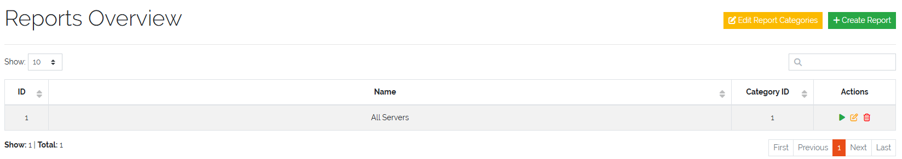
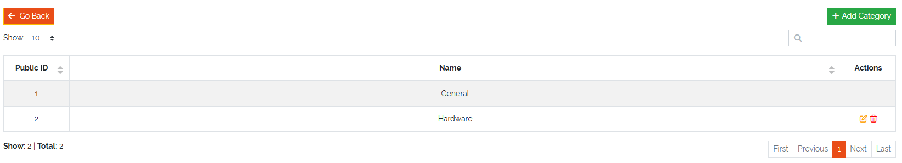
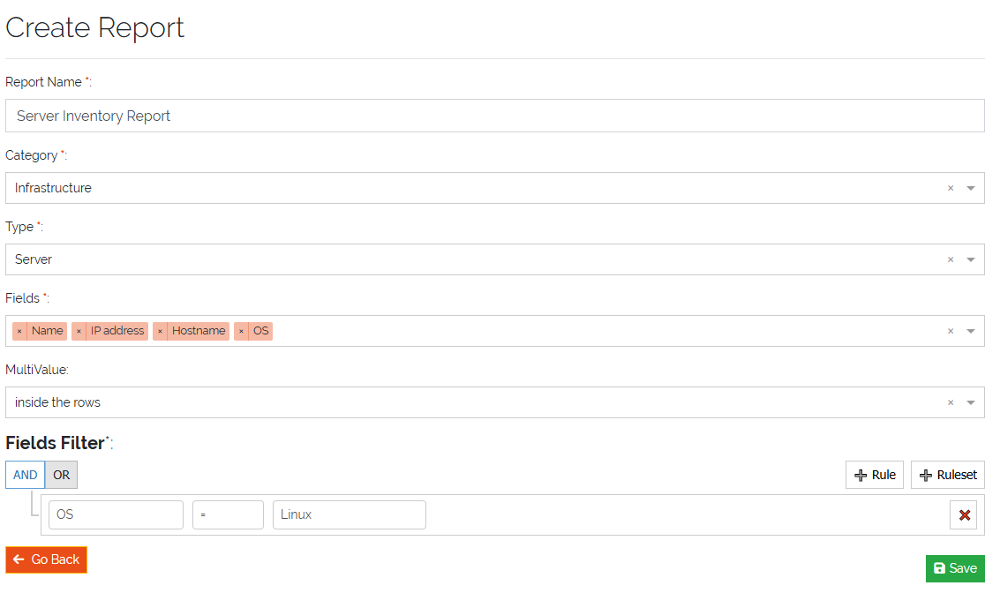

*******
Reports
*******

.. _reports-anchor:

To access reports, navigate to **Toolbox -> Reporting**. This page provides an overview of all created reports.

Above the report overview table, you will find two buttons:

- **Edit Report Categories**: Opens a separate page where report categories can be created, edited, or deleted
- **Create Report**: Opens the form to create a new report

    Picture: Reports overview table

| 

    Picture: Reports overview table

| 

=======================================================================================================================

| 

Creating a Report
-----------------

To access reports, navigate to **Toolbox -> Reporting**. Click the **"Create Report"** button to open the report
creation form.

The form includes the following fields:

- **Report Name**: Enter a descriptive name for the report
- **Category**: Select a category for the report from predefined or user-created categories
- **CmdbType**: Choose the :ref:`Type <types-anchor>` the report is based on (e.g., Server)
- **Fields**: Select which fields of the chosen :ref:`Type <types-anchor>` should appear in the report
- **Multi-value Field Output**: Define how multi-value fields are displayed, either inside rows or inside columns
- **Filter (optional)**: Build complex filter conditions using nested AND / OR statements to limit the data included
  in the report

| 

    Picture: Reports overview table

| 

Once a report is created, it appears in the overview table.

| 

=======================================================================================================================

| 

Running and Exporting Reports
-----------------------------

Reports can be run directly from the overview page. After execution, the report results can be downloaded as a CSV
file for further analysis or sharing.

.. note::
   Reports support flexible filtering and field selection to tailor the output to your specific requirements

| 
