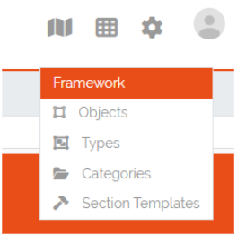

*****************
Section Templates
*****************

.. _section-templates-anchor:

Section templates allow users to create custom sections and insert them via drag-and-drop in type configurations.
This is particularly useful when the same group of fields (a section) is used for different **Types**. Section
templates speed up the creation and modification of types, eliminating the need to repeatedly
create recurring sections.

Section templates can be accessed at the top right corner at **Framework => Section Templates**.

    Picture: Accessing Section Templates

| 

=======================================================================================================================

| 

Section Templates Overview
--------------------------
In the Section Templates overview all created templates are displayed with their PublicID, Name, Type and 
the corresponding actions. At the top left corner of the table is the “Add”-Button with which new section
templates can be created.

    Picture: Section Templates overview

| 

=======================================================================================================================

| 

Creating Section Templates
--------------------------
In this form a section template can be built the same way as in type configurations by drag and drop of elements
from the “Controls”-Sidebar into the “Fields”-area of the section. The only control that is not available to
section templates is the special control **Location** since a type can only have one of these controls and is
therefore only setable directly in the type configuration. Additionally there is a checkbox in the section header
where the template can be defined as a **Global** section template, this can not be changed when editing a section
template. If the checkbox remains unchecked the created section template will be of type **Standard**.

.. figure:: img/section_templates_creation.png
    :width: 700
    :alt: Creation of Section Templates

    Picture: Creation of Section Templates

| 

=======================================================================================================================

| 

Using Section Templates
-----------------------
After a section template has been created it can be used in type configurations. In the sidebar of the type
configuration are two areas, the **Global Section Templates** area  which contain all global and predefined
section templates and the **Section Templates** area which contains all Standard section templates. They can
be added to the type configuration via drag and drop the same way a new section would be added. **Global
Section Templates** are not editable inside the type configuration.

.. figure:: img/section_templates_usage.png
    :width: 700
    :alt: Using section templates in type configuration

    Picture: Using section templates in type configuration

| 

=======================================================================================================================

| 

Section Template Types
----------------------
There are three different types of templates each with a specific purpose. Below is an overview of the
characteristics of each section template type.

| 

Standard Section Templates
^^^^^^^^^^^^^^^^^^^^^^^^^^
- It can be dropped multiple times inside the same type configuration
- After it is dragged inside the type configuration it can be further modified and additional fields can
  be added or existing ones can be deleted
- It can be converted into a **Global Section Template**
- Changing a standard section template in the template configuration won't affect already used instances of it
- There is no programatical connection between the **Standard Section Template** and the type

| 

Global Section Templates
^^^^^^^^^^^^^^^^^^^^^^^^
- It can be dropped only once inside the same type configuration
- It can not be further modified after it was added to a type configuration
- Changes to the global section template in the template configuration will affect all existing instances
  of the template

  - **Example 1:** Adding a field will add the new field to all existing instances of this template
  - **Example 2:** Removing a field will also remove this field from all existing instances of this 
    template (the stored value is lost)
  - **Example 3:** Deleting a global section template will also delete the section and its data from all types and
    objects which are using it

- Types are tracking all of their used **Global Section Templates**

| 

Predefined Section Templates
^^^^^^^^^^^^^^^^^^^^^^^^^^^^
- They have the same characteristics as **Global Section Templates** but are delivered by DataGerry
- They are not editable or deletable by the user
- Users can create a clone of **Predefined Section Templates** but the clone will no longer be considered
  as a predefined section template

| 

=======================================================================================================================

| 

Section Templates - Table Actions
---------------------------------
There are different actions for created section templates depending on the template type. Below is an overview
and explanation of each.

.. figure:: img/section_templates_table_actions.png
    :width: 300
    :alt: Actions for created section templates

    Picture: Actions for created section templates

| 

**Open Preview** |action_preview_img|

.. |action_preview_img| image:: img/section_templates_table_action_preview.png
    :width: 20
    :alt: Open Preview

Opens a preview of the section template which will display how the created section and its fields will look like.

| 

**Edit Section Template** |action_edit_img|

Redirects the user to the edit form for the section template. This action is not available for predefined templates.
Editing a global section template in this form will affect all types and objects using this template.

| 

**Clone Section Template** |action_clone_img|

With this action users can create a clone of an existing template(even a predefined template). A popup will open
where the name and the type of the template can be set. After confirmation the clone will be created.
A cloned predefined template is either of type standard or global.

| 

**Transform Standard Template** |action_transform_img|

.. |action_transform_img| image:: img/section_templates_table_action_transform.png
    :width: 20
    :alt: Transform Standard Template

A standard template can be transformed into a global section template by pressing this action. When the template
is transformed it is seen as a new global section template which means that the previous uses of this standard
template on types are not tracked. Users should consider that this action can not be undone. This action is only
available to standard templates.

| 

**Global Template Indicator** |action_global_img|

.. |action_global_img| image:: img/section_templates_table_action_global.png
    :width: 20
    :alt: Global Template Indicator

This is just an indicator that this template type is **Global** and should represent that this type can not be
transformed. All predefined templates are also global templates.

| 

**Delete Template** |action_delete_img|

.. |action_delete_img| image:: img/section_templates_table_action_delete.png
    :width: 20
    :alt: Delete Template

With this action section templates can be deleted. Consider that deleting a global section template will also
remove it and all set values from types and objects. The amount of affected types and objects will be displayed
in the confirmation popup. Predefined templates are not deletable.

| 

=======================================================================================================================

| 

Section Templates - Rights
--------------------------
The section for managing **Section Templates** has its own set of rights.

| 

**base.framework.sectionTemplates.\***

This right grants all the rights mentioned below and allows the user to do everything with section templates.

| 

**base.framework.sectionTemplates.view**

This right is required to access the section templates via **Framework => Section Templates**. Furthermore it 
is required for the **Open Preview** action.

| 

**base.framework.sectionTemplates.create**

This right is required to create new section templates. Together with **base.framework.sectionTemplates.edit**
it is required to clone templates.

| 

**base.framework.sectionTemplates.edit**

This right is required to edit existing section templates. Together with **base.framework.sectionTemplates.create**
it is required to clone templates.

| 

**base.framework.sectionTemplates.delete**

This right is required to delete existing section templates. Predefined section templates are not deleteable.

| 
